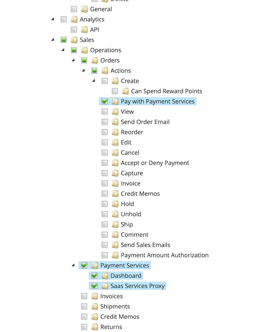

# Configuração de [!DNL Payment Services]

Você pode personalizar o [!DNL Payment Services] de acordo com suas necessidades com opções de configuração úteis no Administrador.

Ao configurar [!DNL Payment Services] para [!DNL Adobe Commerce] e [!DNL Magento Open Source] no Administrador, essas configurações se aplicam apenas ao ambiente definido no campo _[!UICONTROL Method]_de_[!UICONTROL General Configuration]_. Quaisquer alterações feitas nos campos de configuração são independentes da alternância da seleção _[!UICONTROL Method]_. Se você alternar o método, suas seleções não serão redefinidas.

## Configuração geral

Você pode habilitar [!DNL Payment Services] para sua loja e _[!UICONTROL Merchant Location]_e habilitar testes de sandbox ou pagamentos ao vivo na seção_[!UICONTROL General Configuration]_.

1. Na barra lateral _Admin_, vá para **[!UICONTROL Stores]** > _[!UICONTROL Settings]_>**[!UICONTROL Configuration]**.
1. No painel esquerdo, expanda **[!UICONTROL Sales]** e escolha **[!UICONTROL Payment Methods]**.
1. Defina o campo _[!UICONTROL Merchant Country]_no_[!UICONTROL Merchant Location]_. Se um _[!UICONTROL Merchant Country]_não for especificado, o_[!UICONTROL Default Country]_ da configuração geral será usado.
1. Expanda a seção _[!UICONTROL FEATURED ADOBE PAYMENT SOLUTION]_para acessar a seção_[!UICONTROL [!DNL Payment Services]]_.
1. Na seção _[!UICONTROL [!DNL Payment Services]]_, expanda a seção_[!UICONTROL General Configuration]_.
1. Para **Habilitar**, defina-o como `Yes` para habilitar [!DNL Payment Services] para seu armazenamento.
1. Para o **Método**, defina-o como `Sandbox` se você ainda estiver testando o [!DNL Payment Services] para sua loja ou `Production` se você estiver pronto para habilitar pagamentos ao vivo.
1. Os valores **[!UICONTROL Payment Services Sandbox ID]** e **[!UICONTROL Payment Services Production ID]** são preenchidos automaticamente depois que você configura o [Commerce Services Connector](https://experienceleague.adobe.com/en/docs/commerce-merchant-services/user-guides/integration-services/saas){target=_blank} e visita o painel [!DNL Payment Services] pela primeira vez. Faça isso para concluir a integração dos ambientes de sandbox e/ou produção. Esses valores associam sua SaaS ID a [!DNL Payment Services].

   >[!WARNING]
   >
   > Se precisar alterar a ID do espaço de dados no Commerce Services Connector, redefina a ID do [!DNL Payment Services]. Clique em **Redefinir ID de Serviços de Pagamento** para redefinir sua ID de Sandbox. Se você redefinir sua ID de sandbox do [!DNL Payment Services], será necessário integrar novamente.

1. Seus valores de **[!UICONTROL PayPal Merchant ID]** e **[!UICONTROL PayPal Merchant Status]** são fornecidos automaticamente pelo PayPal assim que você visita o painel [!DNL Payment Services] pela primeira vez.
1. Para o **Descritor Flexível** (valores personalizados que são exibidos em demonstrativos bancários de transações do cliente para definir entre lojas/marcas/catálogos), adicione seu texto personalizado (até 22 caracteres) ao campo de texto, substituindo `Soft descriptor` ou o valor existente.
1. Clique em **[!UICONTROL Save Config]** para salvar suas alterações.
1. Navegue até **[!UICONTROL System]** > **[!UICONTROL Cache Management]** e clique em **[!UICONTROL Flush Cache]** para atualizar todos os caches inválidos.

### Opções de configuração

| Campo | Escopo | Descrição |
|---|---|---|
| [!UICONTROL Enable] | site | Habilite ou desabilite o [!DNL Payment Services] para o seu site. Opções: `[!UICONTROL Yes]` / `[!UICONTROL No]` |
| [!UICONTROL Method] | exibição de loja | Defina o método ou ambiente para sua loja. Opções: [!UICONTROL Sandbox] / [!UICONTROL Production] |
| [!UICONTROL Payment Services Sandbox ID] | exibição de loja | Sua ID de comerciante de sandbox, que é gerada automaticamente durante a integração da sandbox. |
| [!UICONTROL Payment Services Production ID] | exibição de loja | Sua ID de comerciante de produção, que é gerada automaticamente durante a integração da produção (ao vivo). |
| [!UICONTROL PayPal Merchant ID] | exibição de loja | Sua ID exclusiva de conta de comerciante do PayPal, gerada ao criar sua conta do PayPal. |
| [!UICONTROL PayPal Merchant Status] | exibição de loja | Status da ID de Comerciante do PayPal. |
| [!UICONTROL Soft Descriptor] | exibição de site ou loja | Adicione um descritor simples ao(s) site(s) e às visualizações da loja para adicionar informações às transações do cliente que definem marcas, lojas ou linhas de produtos. |

## [!UICONTROL Credit Card Fields]

As opções de pagamento do [!UICONTROL Credit Card Fields] oferecem check-out simples e seguro para métodos de pagamento com cartão de crédito ou débito.

Consulte [Opções de pagamentos](payments-options.md#paypal-smart-buttons) para obter mais informações.

1. Na barra lateral _Admin_, vá para **[!UICONTROL Stores]** > _[!UICONTROL Settings]_>**[!UICONTROL Configuration]**.
1. No painel esquerdo, expanda **[!UICONTROL Sales]** e escolha **[!UICONTROL Payment Methods]**.
1. Expanda a seção _[!UICONTROL FEATURED ADOBE PAYMENT SOLUTION]_.
1. Na seção _[!UICONTROL Payment Services]_, expanda a seção_[!UICONTROL Credit Card Fields]_.
1. Para **[!UICONTROL Title]**, insira texto (se necessário) para alterar o nome do método de pagamento conforme mostrado durante o check-out.
1. Para [definir a ação de pagamento](production.md#set-payment-services-as-payment-method), selecione **[!UICONTROL Authorize]** ou **Autorizar e Capturar**.
1. Para priorizar um método de pagamento na página de check-out, forneça um valor `Numeric Only` no campo **[!UICONTROL Sort order]**.
1. Para **[!UICONTROL Show on checkout page]**, escolha `Yes` para habilitar campos de cartão de crédito na página de check-out.
1. Para **[!UICONTROL Vault Enabled]**, escolha `Yes` para habilitar a compartimentalização de cartão de crédito para check-out.
1. Para **[!UICONTROL Vault Enabled in Admin]**, escolha `Yes` para permitir que o comerciante crie pedidos para clientes usando seu cartão de crédito com cofre.
1. Para habilitar **[!UICONTROL 3D Secure authentication]** (`Off` por padrão), escolha `Always` ou `When required`.
1. Para **[!UICONTROL Debug Mode]**, escolha `Yes` para habilitar o modo de depuração ou `No` para desabilitá-lo.
1. Clique em **[!UICONTROL Save Config]** para salvar suas alterações.
1. Navegue até **[!UICONTROL System]** > **[!UICONTROL Cache Management]** e clique em **[!UICONTROL Flush Cache]** para atualizar todos os caches inválidos.

### Opções de configuração

| Campo | Escopo | Descrição |
|---|---|---|
| [!UICONTROL Title] | exibição de loja | Adicione o texto a ser exibido como o título para esta opção de pagamento na exibição de Método de Pagamento durante a finalização da compra. Opções: [!UICONTROL text field] |
| [!UICONTROL Payment Action] | site | A [ação de pagamento](https://experienceleague.adobe.com/docs/commerce-admin/config/sales/payment-methods/payment-methods.html) para o método de pagamento especificado. Opções: [!UICONTROL Authorize] / [!UICONTROL Authorize and Capture] |
| [!UICONTROL Sort order] | exibição de loja | A ordem de classificação do método de pagamento especificado na página de check-out. Valor `Numeric Only` |
| [!UICONTROL Show on checkout page] | site | Ative ou desative os campos de cartão de crédito na página de check-out. Opções: [!UICONTROL Yes] / [!UICONTROL No] |
| [!UICONTROL Vault enabled] | exibição de loja | Habilite ou desabilite o [cofre de cartão de crédito](vaulting.md). Opções: [!UICONTROL Yes] / [!UICONTROL No] |
| [!UICONTROL Vault enabled in Admin] | exibição de loja | Habilite ou desabilite o recurso para [comerciante concluir pedidos de clientes no Administrador](vaulting.md) usando um método de pagamento com cofre. Opções: [!UICONTROL Yes] / [!UICONTROL No] |
| [!UICONTROL 3D Secure authentication] | site | Habilite ou desabilite a [autenticação Segura do 3DS](security.md#3ds). Opções: [!UICONTROL Always] / [!UICONTROL When Required] / [!UICONTROL Off] |
| [!UICONTROL Debug Mode] | site | Ative ou desative o Modo de depuração. Opções: `[!UICONTROL Yes]` / `[!UICONTROL No]` |

## [!UICONTROL Fastlane]

[[!DNL Fastlane by PayPal]](https://www.paypal.com/us/cshelp/article/what-is-fastlane-by-paypal-help1096) é uma maneira rápida e fácil de pagar online com segurança. Durante uma **finalização de compra como convidado**, você pode armazenar com segurança seu cartão e seus detalhes de envio para compras ainda mais rápidas no futuro.

Consulte [Opções de pagamento](payments-options.md#fastlane-button) para obter mais informações.

1. Na barra lateral _Admin_, vá para **[!UICONTROL Stores]** > _[!UICONTROL Settings]_>**[!UICONTROL Configuration]**.
1. No painel esquerdo, expanda **[!UICONTROL Sales]** e escolha **[!UICONTROL Payment Methods]**.
1. Expanda a seção _[!UICONTROL FEATURED ADOBE PAYMENT SOLUTION]_.
1. Na seção _[!UICONTROL Payment Services]_, expanda a seção_[!UICONTROL Fastlane]_.
1. Para habilitá-lo, selecione `Yes` para **[!UICONTROL Enable Fastlane]** (`No` desabilita-o).

   >[!NOTE]
   >
   > Se [!UICONTROL Fastlane] estiver habilitado, a opção de pagamento [!UICONTROL Credit Card Fields] será desabilitada.

1. Para **[!UICONTROL Title]**, insira texto (se necessário) para alterar o nome do método de pagamento conforme mostrado durante o check-out. O título padrão é `Credit Card (via Fastlane)`
1. Para [definir a ação de pagamento](production.md#set-payment-services-as-payment-method), selecione **[!UICONTROL Authorize]** ou **Autorizar e Capturar**.
1. Para habilitar **[!UICONTROL 3D Secure Authentication for Fastlane]** (`Off` por padrão), escolha `When required` para cumprir as normas da UE ou `Always` para adicionar uma camada extra de proteção contra fraude.

   >[!NOTE]
   >
   > Se o emissor do cartão exigir autenticação 3D Secure, essa etapa não poderá ser ignorada, independentemente da configuração [!UICONTROL Payment Services].

1. Para priorizar um método de pagamento na página de check-out, forneça um valor `Numeric Only` no campo **[!UICONTROL Sort order]**.
1. Especifique se a identidade visual [!UICONTROL Fastlane] será habilitada durante o check-out no Adobe Commerce definindo o campo **[!UICONTROL Enable messaging]** como `Yes`.
1. Clique em **[!UICONTROL Save Config]** para salvar suas alterações.
1. Navegue até **[!UICONTROL System]** > **[!UICONTROL Cache Management]** e clique em **[!UICONTROL Flush Cache]** para atualizar todos os caches inválidos.

| Campo | Escopo | Descrição |
|---|---|---|
| [!UICONTROL Enable Fastlane] | exibição de loja | Habilite ou desabilite [!DNL Fastlane] na página de check-out. Opções: `[!UICONTROL Yes]` / `[!UICONTROL No]` |
| [!UICONTROL Title] | exibição de loja | Adicione o texto a ser exibido como o título para esta opção de pagamento na exibição de Método de Pagamento durante a finalização da compra. O valor padrão é `Credit Card (via Fastlane)`. Opções: [!UICONTROL text field] |
| [!UICONTROL Payment Action] | site | A [ação de pagamento](https://experienceleague.adobe.com/docs/commerce-admin/config/sales/payment-methods/payment-methods.html) para o método de pagamento especificado. Opções: [!UICONTROL Authorize] / [!UICONTROL Authorize and Capture] |
| [!UICONTROL 3D Secure authentication] | exibição de loja | Habilite ou desabilite a [Autenticação Segura 3D para o Fastlane](security.md#3ds). Opções: [!UICONTROL Always] / [!UICONTROL When Required] / [!UICONTROL Off] |
| [!UICONTROL Sort order] | exibição de loja | A ordem de classificação do método de pagamento especificado na página de finalização da compra. Valor `Numeric Only` |
| [!UICONTROL Enable messaging] | exibição de loja | Especifique se a identidade visual do [!UICONTROL Fastlane] será habilitada durante o check-out no Adobe Commerce. Opções: `[!UICONTROL Yes]` / `[!UICONTROL No]` |

### Opcional. Configurações avançadas de estilo

Essas configurações opcionais podem personalizar como o [!UICONTROL Fastlane] é exibido no seu site.

>[!TIP]
>
>Os estilos que não atendem às diretrizes de acessibilidade revertem para as configurações padrão.

1. Na seção _[!UICONTROL Payment Services]_, navegue até a seção_[!UICONTROL Fastlane]_.
1. Expanda a seção _[!UICONTROL Advanced Style Settings (optional)]_.
1. Modifique as configurações conforme necessário.
1. Clique em **[!UICONTROL Save Config]** para salvar suas alterações.

Consulte os [Documentos do desenvolvedor do PayPal](https://developer.paypal.com/limited-release/accelerated-checkout-bt/) para obter mais informações sobre personalização.

#### Configurações de raiz

Essas configurações opcionais modificam o componente geral de check-out [!UICONTROL Fastlane].

| Campo | Escopo | Descrição |
|---|---|---|
| [!UICONTROL Background Color] | exibição de loja | Define a cor de fundo do componente. Somente `RGB` valores |
| [!UICONTROL Border Color] | exibição de loja | Define a cor da borda do componente. Somente `RGB` valores |
| [!UICONTROL Font Family] | exibição de loja | Define a fonte do componente. Somente as fontes disponíveis no seu tema são exibidas |
| [!UICONTROL Font Size Base] | exibição de loja | Define o tamanho da fonte. Somente `px` valores (pixel) |
| [!UICONTROL Padding] | exibição de loja | Define o preenchimento no componente. Somente `px` valores (pixel) |
| [!UICONTROL Primary Color] | exibição de loja | Define a cor principal do componente. Somente `RGB` valores |
| [!UICONTROL Text Color] | exibição de loja | Define a cor principal do texto no componente. Somente `RGB` valores |

#### Configurações de entrada

Essas configurações opcionais se aplicam aos campos de entrada do cliente do componente [!UICONTROL Fastlane].

| Campo | Escopo | Descrição |
|---|---|---|
| [!UICONTROL Background Color] | exibição de loja | Define a cor de fundo do componente. Somente `RGB` valores |
| [!UICONTROL Border Color] | exibição de loja | Define a cor da borda do componente. Somente `RGB` valores |
| [!UICONTROL Border Radius] | exibição de loja | Define o raio da borda. Somente `px` valores (pixel) |
| [!UICONTROL Border Width] | exibição de loja | Define a largura da borda. Somente `px` valores (pixel) |
| [!UICONTROL Focus Border Color] | exibição de loja | Define a cor da borda de foco do componente. Somente `RGB` valores |
| [!UICONTROL Text Color Base] | exibição de loja | Define a cor principal do texto no componente. Somente `RGB` valores |

## [!UICONTROL Apple Pay]

Com o [!DNL Apple Pay], os comerciantes podem oferecer uma experiência de check-out segura, rápida e contínua no Safari, com suporte para até 99 domínios por conta de comerciante. O botão [!DNL Apple Pay] preenche automaticamente as informações de pagamento, contato e remessa do dispositivo iOS ou macOS do cliente, permitindo compras rápidas, com um toque, que podem ajudar a aumentar as taxas de conversão.

>[!IMPORTANT]
>
> O Apple rejeita pagamentos de domínios não verificados. Os comerciantes devem verificar todos os domínios em que os botões de pagamento do Apple são usados. Restrições de país se aplicam. Consulte a [documentação de pagamento do Apple](https://developer.apple.com/documentation/apple_pay_on_the_web) para obter mais informações sobre os requisitos de verificação de domínio.

Consulte [Opções de pagamentos](payments-options.md#apple-pay-button) para obter mais informações.

1. Na barra lateral _Admin_, vá para **[!UICONTROL Stores]** > _[!UICONTROL Settings]_>**[!UICONTROL Configuration]**.
1. No painel esquerdo, expanda **[!UICONTROL Sales]** e escolha **[!UICONTROL Payment Methods]**.
1. Expanda a seção _[!UICONTROL FEATURED ADOBE PAYMENT SOLUTION]_.
1. Na seção _[!UICONTROL Payment Services]_, expanda a seção_[!UICONTROL Apple Pay]_.
1. Para **[!UICONTROL Title]**, insira texto (se necessário) para alterar o nome do método de pagamento conforme mostrado durante o check-out.
1. Para [definir a ação de pagamento](production.md#set-payment-services-as-payment-method), selecione **[!UICONTROL Authorize]** ou **[!UICONTROL Authorize and Capture]**.
1. Especifique onde a opção [!DNL Apple Pay] está habilitada no Adobe Commerce selecionando `Yes` nas seguintes opções, conforme necessário:
   * **[!UICONTROL Show Apple Pay on checkout page]**
   * **[!UICONTROL Show Apple Pay at start of checkout]**
   * **[!UICONTROL Show Apple Pay on product detail page]**
   * **[!UICONTROL Show Apple Pay in mini cart preview]**
   * **[!UICONTROL Show Apple Pay on cart page]**
1. Para habilitar o modo de depuração, selecione `Yes` para **[!UICONTROL Debug Mode]** (`No` o desabilita).
1. Para salvar as alterações, clique em **[!UICONTROL Save Config]**.
1. Navegue até **[!UICONTROL System]** > **[!UICONTROL Cache Management]** e clique em **[!UICONTROL Flush Cache]** para atualizar todos os caches inválidos.

### Opções de configuração

| Campo | Escopo | Descrição |
|---|---|---|
| [!UICONTROL Title] | exibição de loja | Adicione o texto a ser exibido como o título para esta opção de pagamento na exibição de Método de Pagamento durante a finalização da compra. Opções: [!UICONTROL text field] |
| [!UICONTROL Payment Action] | site | A [ação de pagamento](https://experienceleague.adobe.com/docs/commerce-admin/config/sales/payment-methods/payment-methods.html) para o método de pagamento especificado. Opções: [!UICONTROL Authorize] / [!UICONTROL Authorize and Capture] |
| [!UICONTROL Show Apple Pay on checkout page] | site | Habilite ou desabilite [!DNL Apple Pay] na página de check-out. Opções: `[!UICONTROL Yes]` / `[!UICONTROL No]` |
| [!UICONTROL Show Apple Pay at start of checkout] | exibição de loja | Habilite ou desabilite [!DNL Apple Pay] no início do fluxo de check-out. Opções: `[!UICONTROL Yes]` / `[!UICONTROL No]` |
| [!UICONTROL Sort order] | exibição de loja | A ordem de classificação do método de pagamento especificado na página de finalização da compra. Valor `Numeric Only` |
| [!UICONTROL Show Apple Pay on product detail page] | exibição de loja | Habilite ou desabilite [!DNL Apple Pay] na página de detalhes do produto. Opções: `[!UICONTROL Yes]` / `[!UICONTROL No]` |
| [!UICONTROL Show Apple Pay in mini cart preview] | exibição de loja | Habilite ou desabilite [!DNL Apple Pay] na pré-visualização do minicarrinho. Opções: `[!UICONTROL Yes]` / `[!UICONTROL No]` |
| [!UICONTROL Show Apple Pay on cart page] | exibição de loja | Habilite ou desabilite o [!DNL Apple Pay] na página do carrinho. Opções: `[!UICONTROL Yes]` / `[!UICONTROL No]` |
| [!UICONTROL Debug Mode] | site | Ative ou desative o Modo de depuração. Opções: `[!UICONTROL Yes]` / `[!UICONTROL No]` |

## [!UICONTROL Google Pay]

A opção de pagamento [!UICONTROL Google Pay] permite que o comerciante ofereça o Google Pay aos seus compradores, que podem usar a Carteira do Google em seus dispositivos para fazer compras.

Consulte [Opções de pagamentos](payments-options.md#google-pay-button) para obter mais informações.

1. Na barra lateral _Admin_, vá para **[!UICONTROL Stores]** > _[!UICONTROL Settings]_>**[!UICONTROL Configuration]**.
1. No painel esquerdo, expanda **[!UICONTROL Sales]** e escolha **[!UICONTROL Payment Methods]**.
1. Expanda a seção _[!UICONTROL FEATURED ADOBE PAYMENT SOLUTION]_.
1. Na seção _[!UICONTROL Payment Services]_, expanda a seção_[!UICONTROL Google Pay]_.
1. (Opcional) Altere o nome do método de pagamento mostrado durante o check-out inserindo o novo nome no campo **[!UICONTROL Title]**.
1. [Defina a ação de pagamento](production.md#set-payment-services-as-payment-method) selecionando **[!UICONTROL Authorize]** ou **[!UICONTROL Authorize and Capture]**.
1. Especifique onde a opção [!DNL Google Pay] está habilitada no Adobe Commerce selecionando `Yes` nas seguintes opções, conforme necessário:
   * **[!UICONTROL Show Google Pay on checkout page]**
   * **[!UICONTROL Show Google Pay at start of checkout]**
   * **[!UICONTROL Show Google Pay on product detail page]**
   * **[!UICONTROL Show Google Pay in mini cart preview]**
   * **[!UICONTROL Show Google Pay on cart page]**
1. Para habilitar **[!UICONTROL 3D Secure authentication]** (`Off` por padrão), escolha `Always` ou `When required`.
1. Para habilitar o modo de depuração, selecione `Yes` para **[!UICONTROL Debug Mode]** (`No` o desabilita).
1. Configure a aparência do botão _[!UICONTROL Google Pay]_selecionando **[!UICONTROL Button Color]**,**[!UICONTROL Button Type]**e **[!UICONTROL Button Style]**conforme necessário.
1. Para definir a altura, usa o valor padrão para a altura definida em **[!UICONTROL Button Style]**.
1. Para salvar as alterações, clique em **[!UICONTROL Save Config]**.
1. Navegue até **[!UICONTROL System]** > **[!UICONTROL Cache Management]** e clique em **[!UICONTROL Flush Cache]** para atualizar todos os caches inválidos.

### Opções de configuração

| Campo | Escopo | Descrição |
|---|---|---|
| [!UICONTROL Title] | exibição de loja | Especifica o rótulo de texto que é exibido para esta opção de pagamento na exibição de Método de Pagamento durante o check-out. Opções: `[!UICONTROL text field]` |
| [!UICONTROL Payment Action] | site | A [ação de pagamento](https://experienceleague.adobe.com/docs/commerce-admin/config/sales/payment-methods/payment-methods.html) para o método de pagamento especificado. Opções: `[!UICONTROL Authorize]` / `[!UICONTROL Authorize and Capture]` |
| [!UICONTROL Show Google Pay on checkout page] | site | Habilite ou desabilite [!DNL Google Pay] na página de check-out. Opções: `[!UICONTROL Yes]` / `[!UICONTROL No]` |
| [!UICONTROL Show Google Pay at start of checkout] | exibição de loja | Habilite ou desabilite [!DNL Google Pay] no início do fluxo de check-out. Opções: `[!UICONTROL Yes]` / `[!UICONTROL No]` |
| [!UICONTROL Sort order] | exibição de loja | A ordem de classificação do método de pagamento especificado na página de finalização da compra. Valor `Numeric Only` |
| [!UICONTROL Show Google Pay on product detail page] | exibição de loja | Habilite ou desabilite [!DNL Google Pay] na página de detalhes do produto. Opções: `[!UICONTROL Yes]` / `[!UICONTROL No]` |
| [!UICONTROL Show Google Pay in mini cart preview] | exibição de loja | Habilite ou desabilite [!DNL Google Pay] na pré-visualização do minicarrinho. Opções: `[!UICONTROL Yes]` / `[!UICONTROL No]` |
| [!UICONTROL Show Google Pay on cart page] | exibição de loja | Habilite ou desabilite [!DNL Google Pay] na página do carrinho. Opções: `[!UICONTROL Yes]` / `[!UICONTROL No]` |
| [!UICONTROL 3D Secure authentication] | exibição de loja | Habilite ou desabilite a [autenticação Segura 3D](security.md#3ds). Opções: [!UICONTROL Always] / [!UICONTROL When Required] / [!UICONTROL Off] |
| [!UICONTROL Debug Mode] | site | Ative ou desative o Modo de depuração. Opções: `[!UICONTROL Yes]` / `[!UICONTROL No]` |
| [!UICONTROL Button Color] | Exibição da loja | Defina a cor do botão [!DNL Google Pay]. Opções: `[!UICONTROL Default]` / `[!UICONTROL Black]` / `[!UICONTROL White]` |
| [!UICONTROL Button Type] | Exibição da loja | Defina o tipo do botão [!DNL Google Pay]. Opções: `[!UICONTROL buy]` / `[!UICONTROL checkout]` / `[!UICONTROL order]` / `[!UICONTROL pay]` / `[!UICONTROL plain]` |

Consulte a documentação das [opções de objeto da solicitação de API de Pagamento do Google](https://developers.google.com/pay/api/web/reference/request-objects) para obter mais informações.

## [!DNL PayPal Payment Buttons]

As opções de pagamento do [!DNL PayPal payment buttons] oferecem ao seu cliente um processo de finalização simples, rápido e seguro.

Consulte [Opções de pagamentos](payments-options.md#paypal-smart-buttons) para obter mais informações.

Configurar [!DNL PayPal payment buttons]

Você pode ativar e configurar as opções de pagamento dos botões de pagamento do PayPal em Admin:

1. Na barra lateral _Admin_, vá para **[!UICONTROL Stores]** > _[!UICONTROL Settings]_>**[!UICONTROL Configuration]**.
1. No painel esquerdo, expanda **[!UICONTROL Sales]** e escolha **[!UICONTROL Payment Methods]**.
1. Expanda a seção _[!UICONTROL FEATURED ADOBE PAYMENT SOLUTION]_.
1. Na seção _[!UICONTROL Payment Services]_, expanda a seção_[!UICONTROL PayPal payment buttons]_.
1. Para alterar o nome do método de pagamento conforme mostrado durante o check-out, edite o campo _[!UICONTROL Title]_.
1. Para [definir a ação de pagamento](production.md#set-payment-services-as-payment-method), selecione **[!UICONTROL Authorize]** ou **[!UICONTROL Authorize and Capture]**.
1. Para priorizar um método de pagamento na página de check-out, forneça um valor `Numeric Only` no campo **[!UICONTROL Sort order]**.
1. Para habilitar/desabilitar as [mensagens de Pagamento Posterior](payments-options.md#pay-later-button), selecione `Yes`/`No` para **[!UICONTROL Display Pay Later Message]**.

   * Se você habilitar as [mensagens de Pagamento Posterior](payments-options.md#pay-later-button), um botão modal **[!UICONTROL Configure Messaging]** será exibido para que você possa definir os estilos de **[!UICONTROL PayPal Pay Later messaging]**.

1. Especifique onde os botões de pagamento do PayPal são habilitados no Adobe Commerce selecionando `Yes` nas seguintes opções, conforme necessário:
   * **[!UICONTROL Show buttons on checkout page]**
   * **[!UICONTROL Show buttons at start of checkout]**
   * **[!UICONTROL Show buttons on product detail page]**
   * **[!UICONTROL Show buttons in mini cart preview]**
   * **[!UICONTROL Show buttons on cart page]**
1. Para habilitar Venmo como uma opção de pagamento, selecione `Yes` para **[!UICONTROL Venmo Enabled]**.
1. Para habilitar cartões de crédito e débito como opção de pagamento (botão Inteligente do PayPal), selecione `Yes` para **[!UICONTROL Credit and Debit Card Enabled]**.
1. Para habilitar/desabilitar a opção de pagamento [Pagar Mais Tarde](payments-options.md#pay-later-button) do PayPal, selecione `Yes`/`No` para **[!UICONTROL PayPal Pay Later Enabled]**.
1. Para habilitar o modo de depuração, selecione `Yes` para **[!UICONTROL Debug Mode]** (`No` o desabilita).
1. Para salvar as alterações, clique em **[!UICONTROL Save Config]**.
1. Navegue até **[!UICONTROL System]** > **[!UICONTROL Cache Management]** e clique em **[!UICONTROL Flush Cache]** para atualizar todos os caches inválidos.

### Opções de configuração

| Campo | Escopo | Descrição |
|---|---|---|
| [!UICONTROL Title] | exibição de loja | Adicione o texto a ser exibido como o título para esta opção de pagamento na exibição de Método de Pagamento durante a finalização da compra. Opções: campo de texto |
| [!UICONTROL Payment Action] | site | A [ação de pagamento](https://experienceleague.adobe.com/en/docs/commerce-admin/config/sales/payment-methods/payment-methods#payment-actions){target="_blank"} para o método de pagamento especificado. Opções: [!UICONTROL Authorize] / [!UICONTROL Authorize and Capture] |
| [!UICONTROL Display Pay Later Message] | site | Ative ou desative as mensagens do PayPal Pay Later no carrinho de compras, página do produto, minicarrinho e durante o fluxo de finalização. Opções: `[!UICONTROL Yes]` / `[!UICONTROL No]` |
| [!UICONTROL Configure Messaging] | exibição de loja | Modificar os estilos de Mensagens Posteriores do PayPal. Opções: `[!UICONTROL Product page]` / `[!UICONTROL Cart]` |
| [!UICONTROL Show buttons on checkout page] | exibição de loja | Habilite ou desabilite [!DNL PayPal payment buttons] na página de check-out. Opções: `[!UICONTROL Yes]` / `[!UICONTROL No]` |
| [!UICONTROL Show buttons at start of checkout] | exibição de loja | Habilite ou desabilite [!DNL PayPal payment buttons] no início do fluxo de check-out. Opções: `[!UICONTROL Yes]` / `[!UICONTROL No]` |
| [!UICONTROL Sort order] | exibição de loja | A ordem de classificação do método de pagamento especificado na página de finalização da compra. Valor `Numeric Only` |
| [!UICONTROL Show buttons on product detail page] | exibição de loja | Habilite ou desabilite [!DNL PayPal payment buttons] na página de detalhes do produto. Opções: `[!UICONTROL Yes]` / `[!UICONTROL No]` |
| [!UICONTROL Show buttons in mini cart preview] | exibição de loja | Habilite ou desabilite [!DNL PayPal payment buttons] na pré-visualização do minicarrinho. Opções: `[!UICONTROL Yes]` / `[!UICONTROL No]` |
| [!UICONTROL Show buttons on cart page] | exibição de loja | Habilite ou desabilite o [!DNL PayPal payment buttons] na página do carrinho. Opções: `[!UICONTROL Yes]` / `[!UICONTROL No]` |
| [!UICONTROL App Switch] | exibição de loja | Esta opção se aplica somente a comerciantes e compradores de **US**. Quando ativados, todos os pagamentos do PayPal Express tentarão passar pelo aplicativo móvel do PayPal, quando disponível. Opções: `[!UICONTROL Yes]` / `[!UICONTROL No]` |
| [!UICONTROL Contact Preference] | exibição de loja | Esta opção se aplica somente a comerciantes e compradores de **US**. Se definido como **sim**, o email e o número de telefone dos compradores serão exibidos no Modal de Pagamento do PayPal. Opções: `[!UICONTROL Yes]` / `[!UICONTROL No]` |
| [!UICONTROL Venmo Enabled] | exibição de loja | Habilite ou desabilite a opção de pagamento Venmo onde os botões de pagamento são exibidos. Opções: `[!UICONTROL Yes]` / `[!UICONTROL No]` |
| [!UICONTROL Credit and Debit Card Enabled] | exibição de loja | Ative ou desative as opções de cartão de Crédito e Débito onde os botões de pagamento são exibidos. Opções: `[!UICONTROL Yes]` / `[!UICONTROL No]` |
| [!UICONTROL PayPal Pay Later Enabled] | exibição de loja | Ativar ou desativar a aparência da opção de pagamento PayPal Pay Posteriormente, onde os botões de pagamento são exibidos. Opções: `[!UICONTROL Yes]` / `[!UICONTROL No]` |
| [!UICONTROL Debug Mode] | site | Ative ou desative o Modo de depuração. Opções: `[!UICONTROL Yes]` / `[!UICONTROL No]` |

## Métodos de pagamento locais

Os métodos de pagamento locais (LPMs) oferecem suporte a métodos de pagamento locais e específicos da região, como transferências bancárias e soluções de pagamento localizadas, juntamente com as opções existentes baseadas em cartão. Os comerciantes podem ativar ou desativar LPMs disponíveis diretamente na configuração do Commerce. Consulte [Opções de pagamento](payments-options.md#local-payment-methods) para obter mais informações sobre os métodos disponíveis.

1. Na barra lateral _Admin_, vá para **[!UICONTROL Stores]** > _[!UICONTROL Settings]_>**[!UICONTROL Configuration]**.
1. No painel esquerdo, expanda **[!UICONTROL Sales]** e escolha **[!UICONTROL Payment Methods]**.
1. Expanda a seção _[!UICONTROL FEATURED ADOBE PAYMENT SOLUTION]_.
1. Na seção _[!UICONTROL Payment Services]_, expanda a seção_[!UICONTROL Local Payment Methods]_.
1. Para **[!UICONTROL Active]**, selecione `Yes` para habilitar LPMs ou `No` para desabilitá-los.
1. Para **[!UICONTROL Title]**, insira o texto a ser exibido como o nome do método de pagamento durante o check-out. Esse título também aparece na grade da ordem de venda.
1. Para **[!UICONTROL Allowed Payment Methods]**, selecione os métodos de pagamento que deseja oferecer. Os métodos disponíveis dependem do endereço de faturamento do comprador e da moeda base do site.
1. Para **[!UICONTROL Sort Order]**, insira um valor numérico para determinar a posição de exibição de LPMs na lista de métodos de pagamento disponíveis.
1. Para salvar as alterações, clique em **[!UICONTROL Save Config]**.
1. Navegue até **[!UICONTROL System]** > **[!UICONTROL Cache Management]** e clique em **[!UICONTROL Flush Cache]** para atualizar todos os caches inválidos.

### Opções de configuração

| Campo | Escopo | Descrição |
|---|---|---|
| [!UICONTROL Active] | site | Ative ou desative os Métodos de pagamento locais. Opções: `[!UICONTROL Yes]` / `[!UICONTROL No]` |
| [!UICONTROL Title] | exibição de loja | O nome do método de pagamento exibido durante o check-out e na grade da ordem de venda. Opções: [!UICONTROL text field] |
| [!UICONTROL Allowed Payment Methods] | site | Selecione os LPMs a serem oferecidos. Os métodos só são visíveis para clientes cujo endereço de faturamento e moeda do site correspondem aos requisitos do método. Opções: `Bancontact` / `BLIK` / `eps` / `iDEAL` / `MyBank` / `Przelewy24` |
| [!UICONTROL Sort Order] | exibição de loja | A posição de exibição do grupo LPM na lista de métodos de pagamento disponíveis. Esta configuração se aplica a todos os LPMs como um grupo; LPMs individuais não podem ser classificados independentemente. Valor `Numeric Only` |

>[!NOTE]
>
>Cada método de pagamento local (LPM) tem requisitos específicos de país e moeda. Um método de pagamento é exibido somente quando o país do endereço de faturamento do cliente e a moeda base do site correspondem a esses requisitos. Por exemplo, Bancontact aparece somente para clientes com um endereço de cobrança belga quando a moeda base é EUR.

## Itens de linha

Os itens de linha enviam informações detalhadas do pedido para o PayPal, incluindo detalhes do produto, quantidades e preços. Esse recurso é ativado por padrão. Consulte [Itens de linha](line-items.md) para obter mais informações.

### Opções de configuração

| Campo | Escopo | Descrição |
|---|---|---|
| [!UICONTROL Line Items Enabled] | site | Ative ou desative o envio de itens de linha e detalhamento de valor para o PayPal. Desabilite esta configuração se você usar extensões de terceiros que adicionam taxas personalizadas não suportadas pelo [!DNL Payment Services]. Opções: `[!UICONTROL Yes]` / `[!UICONTROL No]` |

## Estilo do botão

Você também pode configurar as opções _[!UICONTROL Button style]_dos botões de pagamento:

1. Na barra lateral _Admin_, vá para **[!UICONTROL Stores]** > _[!UICONTROL Settings]_>**[!UICONTROL Configuration]**.
1. No painel esquerdo, expanda **[!UICONTROL Sales]** e escolha **[!UICONTROL Payment Methods]**.
1. Expanda a seção _[!UICONTROL FEATURED ADOBE PAYMENT SOLUTION]_.
1. Na seção _[!UICONTROL [!DNL Payment Services]]_, expanda a seção_[!UICONTROL PayPal Smart Button Styling]_.
1. Para definir o layout, selecione `Vertical` ou `Horizontal` para **[!UICONTROL Layout]**
1. Para definir a cor, selecione uma das cores disponíveis em **[!UICONTROL Color]**.
1. Para definir a forma, selecione `Rectangular` ou `Pill` para **[!UICONTROL Shape]**.
1. Para usar a altura padrão, selecione `Yes` ou `No` para **[!UICONTROL Use Default Height]**.
1. Para definir a altura personalizada, adicione a altura de pixel desejada para **[!UICONTROL Height]**.
1. Para definir o slogan, selecione `Yes` ou `No` para **[!UICONTROL Tagline]**.
1. Para salvar as alterações, clique em **[!UICONTROL Save Config]**.
1. Navegue até **[!UICONTROL System]** > **[!UICONTROL Cache Management]** e clique em **[!UICONTROL Flush Cache]** para atualizar todos os caches inválidos.

### Opções de configuração

| Campo | Escopo | Descrição |
|--- |--- |--- |
| [!UICONTROL Layout] | Exibição da loja | Definir estilo de layout para botões de pagamento Paypal. Opções: `[!UICONTROL Vertical]` / `[!UICONTROL Horizontal]` |
| [!UICONTROL Color] | Exibição da loja | Defina a cor dos botões de pagamento do Paypal. Opções: [!UICONTROL Blue] / `[!UICONTROL Gold]` / `[!UICONTROL Silver]` / `[!UICONTROL White]` / `[!UICONTROL Black]` |
| [!UICONTROL Shape] | Exibição da loja | Defina a forma dos botões de pagamento Paypal. Opções: `[!UICONTROL Rectangular]` / `[!UICONTROL Pill]` |
| [!UICONTROL Use Default Height] | Exibição da loja | Define se os botões de pagamento do PayPal usam uma altura padrão. Opções: `[!UICONTROL Yes]` / `[!UICONTROL No]` |
| [!UICONTROL Height] | Exibição da loja | Defina a altura dos botões de pagamento do PayPal. Valor padrão: nenhum |
| [!UICONTROL Label] | Exibição da loja | Defina o rótulo que aparece nos botões de pagamento do PayPal. Opções: `[!UICONTROL PayPal]` / `[!UICONTROL Checkout]` / `[!UICONTROL Buynow]` / `[!UICONTROL Pay]` / `[!UICONTROL Installment]` |
| [!UICONTROL Tagline] | Exibição da loja | Ativa o slogan. Opções: `[!UICONTROL Yes]` / `[!UICONTROL No]` |

## Liberar o cache

Se você alterar a configuração em _Configurações_, por exemplo, alternando os botões Apple Pay, Venmo ou PayPal PayLater, limpe manualmente o cache para que sua loja mostre as configurações mais recentes.

1. Na barra lateral _Admin_, vá para **[!UICONTROL System]** > **[!UICONTROL Cache Management]**.
1. Clique em **[!UICONTROL Flush Cache]** para atualizar todos os caches inválidos.

Se qualquer Tipo de Cache na tabela Gerenciamento de Cache tiver um status `INVALIDATED`, seu repositório talvez não mostre a configuração mais recente para esse item. Limpe o cache para atualizar seu armazenamento para mostrar a configuração mais recente.

Para garantir que seu armazenamento mostre a configuração correta, [limpe o cache](https://experienceleague.adobe.com/en/docs/commerce-admin/systems/tools/cache-management) periodicamente.

## Configurar funções

Para garantir que os usuários Administradores possam criar e gerenciar pedidos no Administrador do Commerce, habilite os recursos específicos do [!DNL Payment Services] para funções de usuário.

Consulte [Funções de usuário](https://experienceleague.adobe.com/docs/commerce-admin/systems/user-accounts/permissions-user-roles.html) para saber como gerenciar funções.

Ao atribuir recursos à função, você deve selecionar:

* **Pagar com[!DNL Payment Services]** — Esse recurso garante que, ao criar um pedido no Administrador, [!DNL Payment Services] cartões de crédito estejam disponíveis como um método de pagamento. Se você selecionar o recurso pai **Ações**, esse recurso também será selecionado.

* **[!DNL Payment Services]**—Este recurso inclui os recursos **Dashboard** e **Proxy de Serviços SaaS**, que também devem ser selecionados. Eles garantem que [!DNL Payment Services] apareça no menu _Vendas_.

  {width="400" zoomable="yes"}

## Compartimentalização da placa

Você pode ativar a funcionalidade que permite aos clientes arquivar — ou &quot;salvar&quot; — as informações de cartão de crédito em sua conta para uso em compras futuras.

Você também pode usar a compartimentalização de cartão no Administrador para concluir pedidos subsequentes de clientes existentes.

Habilite ou desabilite a compartimentalização de cartão nas [configurações de campo de cartão de crédito](#credit-card-fields).

Consulte [Compartimentalização de cartão de crédito](vaulting.md) para obter mais informações.

## 3DS

O 3DS protege clientes e comerciantes de atividades fraudulentas em suas lojas e permite a conformidade com os padrões da União Europeia (UE).

Habilite ou desabilite o 3DS nas [Configurações do campo de cartão de crédito](#credit-card-fields).

Consulte [3DS em Segurança](security.md#3ds) para obter mais informações.

## Usar várias contas do PayPal

No [!UICONTROL Payment Services], você pode usar várias contas do PayPal em **uma** conta de comerciante no nível do site. Por exemplo, se você estiver operando sua(s) loja(s) em vários países (que usam [moedas](https://experienceleague.adobe.com/en/docs/commerce-admin/stores-sales/site-store/currency/currency) diferentes) ou se quiser usar o Adobe Commerce para algumas partes de sua empresa, mas não _todas_, é possível configurar sua conta de comerciante para usar várias contas do PayPal.

Consulte [Escopo de Site, Armazenamento e Exibição](https://experienceleague.adobe.com/docs/commerce-admin/start/setup/websites-stores-views.html) para obter mais informações sobre a hierarquia de sites, lojas e exibições de loja.

Consulte [Configuração de linha de comando](configure-cli.md#configure-scope-via-cli) para obter mais informações sobre a configuração de escopos para várias contas do PayPal via CLI.

Seu representante de vendas pode criar um novo [escopo](https://experienceleague.adobe.com/docs/commerce-admin/start/setup/websites-stores-views.html#scope-settings) para sua conta de comerciante e integrar o site adicional com o PayPal para que qualquer um dos botões do PayPal que você configura para aparecer apareça em seu site. Entre em contato com seu setor de Vendas
representante para obter assistência com o uso de várias contas do PayPal para seus sites.
