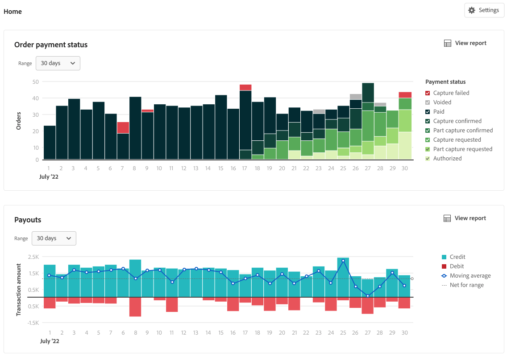

# Relatórios financeiros

O [!DNL Payment Services] for [!DNL Adobe Commerce] e [!DNL Magento Open Source] oferece relatórios abrangentes para você ter uma visão clara dos pedidos e pagamentos da loja.

{width="600" zoomable="yes"}

Os relatórios de gerenciamento de fluxo de caixa — Pagamentos, Transações e Status de pagamento de Pedidos — sincronizam os detalhes do pagamento com as informações do pedido para fornecer total transparência do volume processado, saldo de pagamento e relatórios detalhados em um nível de transação para reconciliação financeira.

>[!NOTE]
>
>Sua implantação determina qual desses relatórios é exibido no [!DNL Payment Services] **painel**. Em [!DNL Adobe Commerce as a Cloud Service] e [!DNL Adobe Commerce Optimizer], o painel expõe os relatórios **selecionados** (incluindo [Transações](reporting.md) da Página Inicial). [Status do pagamento da ordem](order-payment-status.md) e [Pagamentos](payouts.md) As exibições da página inicial e os relatórios vinculados estão disponíveis no Adobe Commerce na nuvem e localmente, conforme descrito nesses tópicos. Consulte [[!DNL Payment Services] Página Inicial](payments-home.md).
