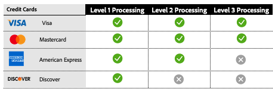

# Processamento de nível 2 e nível 3

A [!DNL Payment Services] oferece recursos avançados de processamento de cartão para ajudar os comerciantes a otimizar suas transações de pagamento e reduzir as taxas de intercâmbio. Há três níveis de processamento de cartão disponíveis, cada um com diferentes requisitos de dados de transação.

>[!CAUTION]
>
> Os pedidos do [Fastlane](payments-options.md#fastlane-button) não incluem dados de Nível 2/Nível 3, itens de linha e detalhamento de valor.

## Requisitos em matéria de dados por nível de processamento

{width="500" zoomable="yes"}

O [!DNL Payment Services] coleta esses dados e fornece relatórios detalhados das suas transações de pagamento.

## Níveis de processamento disponíveis por rede de cartão

{width="500" zoomable="yes"}

Consulte [processamento de pagamento](https://developer.paypal.com/docs/checkout/advanced/processing/){target=_blank} na documentação do desenvolvedor do PayPal para obter mais informações.

### Nível 1

O Nível 1 é o mais comum, requer menos informações e, portanto, geralmente incorre em taxas de intercâmbio mais altas em comparação às transações processadas com dados de Nível 2 ou Nível 3, que geralmente estão relacionados a cartões de crédito corporativos e de compra.

### Nível 2 e nível 3

[!DNL Payment Services] comerciantes no Interchange Plus (IC++) podem se qualificar para o processamento de Nível 2/Nível 3 se fornecerem detalhes de transação adicionais a redes de cartões e atenderem a critérios de qualificação específicos. Esses níveis são particularmente benéficos para os comerciantes que lidam com volumes significativos de compras ou de cartões corporativos, pois podem resultar em economias significativas de custos. O fornecimento de dados detalhados de Nível 2 ou Nível 3 pode:

* Diminua as taxas de processamento e otimize os custos gerais
* Evite fraudes, diminuindo o risco do processador
* Melhorar a segurança da transação

Consulte [O que é IC++?](https://www.paypal.com/us/brc/article/what-is-interchange-plus-plus){target=_blank} na documentação do desenvolvedor do PayPal para obter mais informações.

## Transações de pagamento com cartão de Nível 2 e Nível 3 em [!DNL Payment Services]

Para se qualificarem para o processamento de nível 2 ou nível 3, os comerciantes devem enviar as informações anteriores, embora sejam as redes de cartões que, em última análise, determinam para qual nível uma transação se qualifica durante o processamento.

Consulte as [Perguntas frequentes sobre o processamento de pagamentos](https://www.paypal.com/us/cshelp/article/ts2278?_ga=1.131773126.875104296.1712843492){target=_blank} na documentação do desenvolvedor do PayPal para obter mais informações.

O processamento de nível 2 e nível 3 está desabilitado por padrão para [!DNL Payment Services] comerciantes no nível da loja.

O processamento de nível 2 e nível 3 estará disponível se você já estiver usando os preços do IC++. Para habilitar este recurso, você pode fazer isso através da [Interface de Linha de Comando (CLI](configure-cli.md)).

>[!IMPORTANT]
>
>Em caso de dúvidas, entre em contato com o gerente de conta do [!DNL Payment Services].
