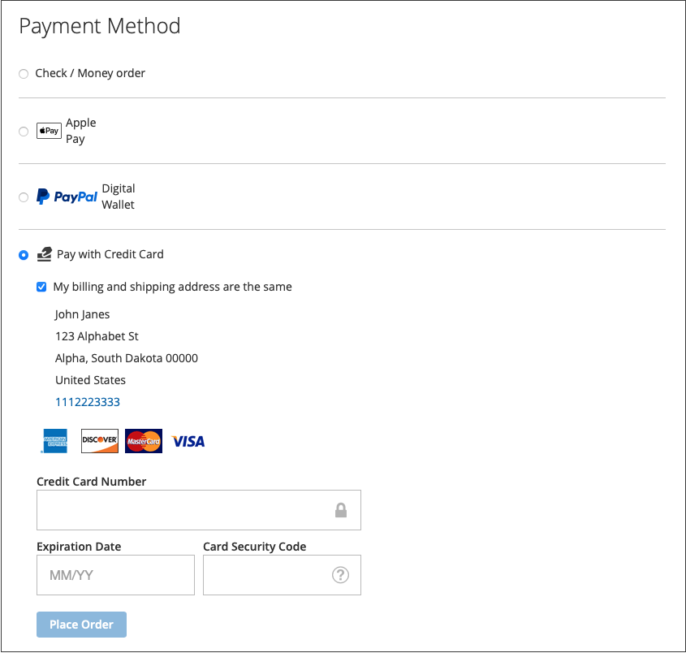
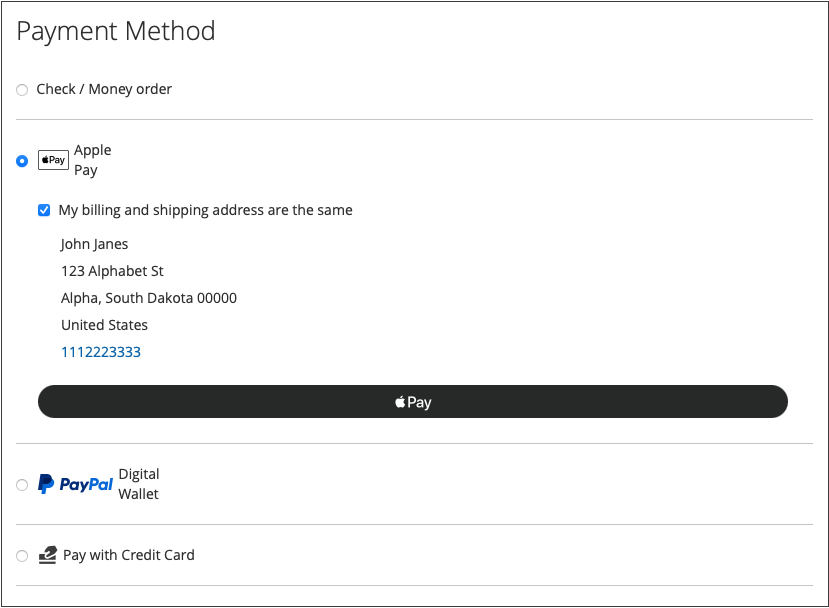
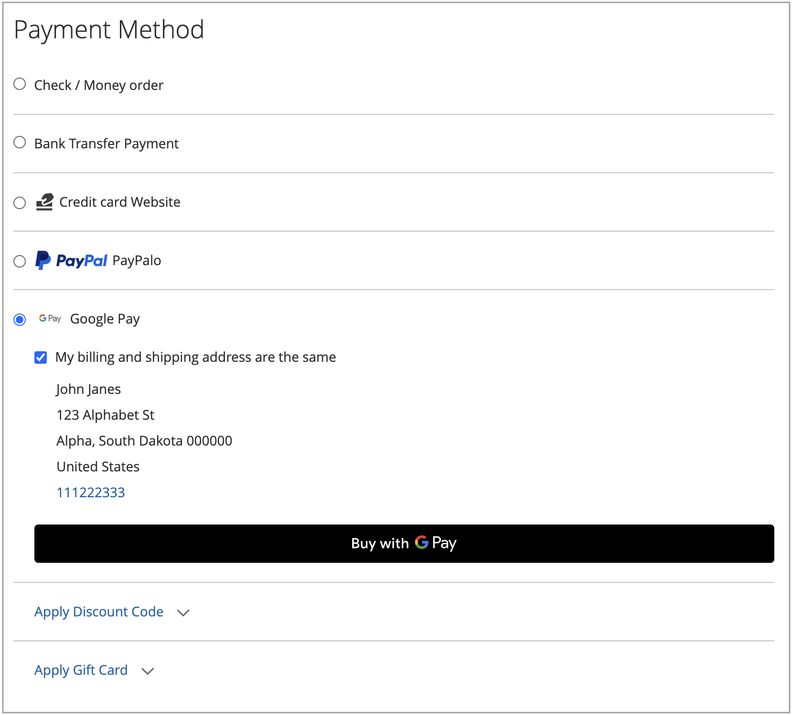
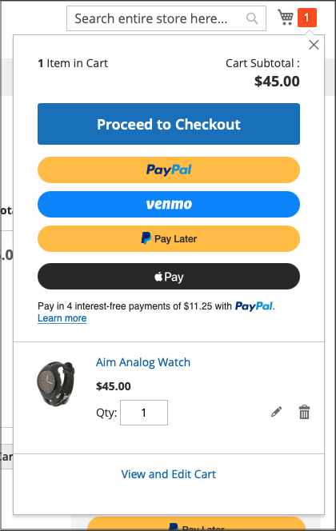
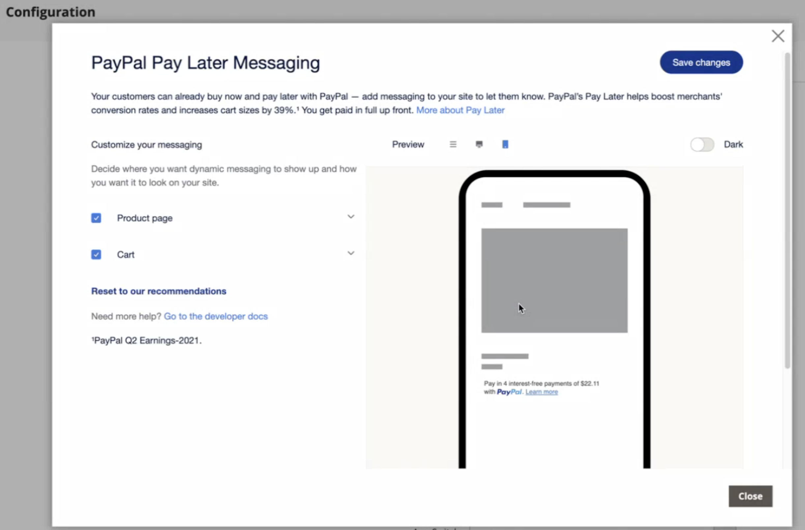

# Opções de pagamento

Com [!DNL Adobe Commerce] e [!DNL Magento Open Source] [!DNL Payment Services], você tem várias opções de pagamento disponíveis.

Você pode definir essas opções de pagamento em [Configurações da página inicial](payments-home.md) ou [Configuração da loja](configure-admin.md) (recomendado para opções de pagamento herdadas ou para uma configuração de várias lojas).

Há comportamentos diferentes para cada método de pagamento, dependendo de onde você está no processo de finalização:

* Página do produto — A página de produto de um item
* Minicarrinho — Disponível após clicar no ícone do carrinho quando um produto foi adicionado aos carrinhos
* Carrinho de compras — Disponível ao clicar em _Exibir e editar carrinho_ no minicarrinho
* Exibição de check-out — Disponível ao clicar em _Prosseguir para o check-out_ do minicarrinho ou carrinho de compras

>[!IMPORTANT]
>
>A integração do [!DNL Payment Services] deve ser concluída para que os pagamentos possam ser processados.

## Experiência de Pagamentos Padrão vs. Avançados

A [!DNL Payment Services] fornece opções de pagamento e fluxos de integração **Avançado** (com suporte total) e **Padrão** (Check-out Expresso), dependendo do país em que você opera.

* **Avançado** - Todas as [opções de pagamentos](../payment-services/payments-options.md) disponíveis estão disponíveis para os [países com suporte total](compatibility.md#standard-vs-advanced-payment-services-experience) atuais. Durante a integração para habilitar pagamentos ao vivo, selecione a [opção de integração avançada](../payment-services/production.md#advanced-onboarding).

* **Padrão** - Um subconjunto de opções de pagamento (Check-out Expresso)—cartões de crédito e débito do PayPal—está disponível para outros países com suporte. [Os campos de cartão de crédito](#credit-card-fields) e [Pagamento Apple](#apple-pay-button) não estão disponíveis para esta opção de integração. Durante a integração para habilitar pagamentos ao vivo, selecione a [Opção de integração padrão](../payment-services/production.md#standard-onboarding).

Consulte [Habilitar [!DNL Payment Services] para produção](../payment-services/production.md#complete-merchant-onboarding) para obter informações sobre como concluir a integração avançada e padrão.

## [!UICONTROL Credit Card Fields]

[!UICONTROL Credit Card Fields] fornece um check-out simples e seguro para métodos de pagamento com cartão de crédito ou débito. Quando um comprador faz o check-out usando campos de cartão de crédito, ele insere seu nome, endereço de cobrança e informações de cartão de crédito ou débito para fazer seu pedido. As informações de seus clientes são usadas com segurança durante a sessão de compra para orientá-los perfeitamente pelo fluxo de finalização.

{width="500" zoomable="yes"}

## [!UICONTROL Digital Wallets]

### Botão [!DNL Fastlane]

O [!DNL Fastlane] oferece uma maneira rápida, segura e sem complicações de pagar online. Durante uma **finalização de compra como convidado**, você pode armazenar com segurança seu cartão e seus detalhes de envio para compras ainda mais rápidas no futuro.

* **Acesso instantâneo para compradores verificados**: reconheça milhões de clientes recorrentes e habilite pagamentos ininterruptos em segundos.
* **Aumentar receita**: melhore as taxas de conversão e autorização com compras mais concluídas.
* **Agilizar check-out**: reduza o atrito com uma experiência de logon segura e sem senha.

Quando [!DNL Fastlane] está habilitado, a opção [!UICONTROL Credit Card Fields] é desabilitada por padrão.

>[!NOTE]
>
> Em instâncias de sandbox, as transações do Fastlane não mostram o endereço de entrega na visualização Atividade de transação.

Consulte o tópico [Fastlane by PayPal](https://www.paypal.com/us/fastlane){target=_blank} para obter mais informações.

### Botão [!DNL Apple Pay]

Com o [!DNL Apple Pay], os comerciantes podem fornecer uma experiência de check-out segura e simplificada (para até 99 domínios por conta de comerciante), o que pode aumentar as conversões.

* **Safari (macOS e iOS)** — o botão [!DNL Apple Pay] preenche automaticamente os detalhes armazenados de pagamento, contato e envio diretamente do dispositivo Apple do cliente, tanto no início do check-out (expresso) quanto na página final do check-out.
* **Chrome, Firefox e Microsoft Edge** — os compradores podem usar [!DNL Apple Pay] durante o **check-out expresso** e na **etapa final do check-out**. No desktop, um **código QR** é exibido para que o comprador conclua o pagamento na folha de Pagamento do Apple em um **iPhone** (iOS 18 ou posterior) usando o aplicativo Câmera para abrir o fluxo da carteira.

Consulte [Novidades na Carteira e [!DNL Apple Pay]](https://developer.apple.com/videos/play/wwdc2024/10108/?time=35){target=_blank} (Apple Developer, WWDC24) para obter a visão geral da Apple sobre esse fluxo.

{width="500" zoomable="yes"}

Quando ativado, o botão [!DNL Apple Pay] fica visível na página do produto, no minicarrinho, no carrinho de compras e nas exibições de check-out. Você pode configurar [!DNL Apple Pay] na configuração de armazenamento ou na Página Inicial da extensão.

Os clientes podem **aplicar ou remover um único código de regra de preço (cupom) de carrinho** durante o check-out expresso de [!DNL Apple Pay].

>[!NOTE]
>
> O certificado de verificação de domínio Apple Pay já está incluído no código [!DNL Payment Services]. Verifique se o caminho `/.well-known/apple-developer-merchantid-domain-association` retorna um código de resposta 200. Consulte a [documentação do desenvolvedor do PayPal sobre integração com o Apple Pay](https://developer.paypal.com/docs/checkout/apm/apple-pay/#download-and-host-sandbox-domain-association-file) para obter mais informações sobre o certificado **verificação de Domínio do PayPal do Apple**.

Consulte [Configurações](configure-admin.md#apple-pay) para obter mais informações.

#### Limitações para o [!DNL Apple Pay] express

**Códigos promocionais na [!DNL Apple Pay] folha de pagamento**

* Os códigos promocionais inseridos na folha de pagamento [!DNL Apple Pay] se aplicam somente ao fluxo expresso. Eles não são aplicados quando [!DNL Apple Pay] é selecionado na página de check-out padrão.
* Somente **um** código promocional pode ser aplicado por [!DNL Apple Pay] folha de pagamento.
* Não há página de revisão [!DNL Apple Pay]; o comprador conclui a compra diretamente da folha de pagamento.
* Se o comprador fechar e reabrir a folha de pagamento [!DNL Apple Pay], o código promocional inserido anteriormente não será lembrado — somente o valor do desconto permanecerá refletido nos totais.

**Navegadores que não sejam do Safari**

* Os botões [!DNL Apple Pay] não são renderizados em dispositivos Android no fluxo de check-out expresso ou padrão.
* Para **produtos virtuais**, a folha de pagamento [!DNL Apple Pay] ainda solicita um endereço de entrega. O endereço é usado como uma estimativa de melhor esforço do endereço de faturamento para calcular totais, pois a Apple não fornece o endereço de faturamento até que o comprador autorize o pagamento.

### Botão [!DNL Google Pay]

Ao integrar o [!DNL Google Pay] à sua experiência de finalização de compra, os comerciantes podem coletar informações sobre pagamentos salvos, contatos e remessa na Conta da Google do comprador, oferecendo uma finalização de compra conveniente e simplificada em navegadores e aplicativos compatíveis.

O [!DNL Google Pay] está disponível somente em determinados países ou regiões e em determinados dispositivos. Consulte a [[!DNL Google Pay] documentação](https://developer.paypal.com/docs/checkout/apm/google-pay/#link-googlepayintegration) para obter mais informações.

{width="500" zoomable="yes"}

Quando ativado, o botão [!DNL Google Pay] fica visível na página do produto, no minicarrinho, no carrinho de compras e nas exibições de check-out. Consulte [Configurações](configure-admin.md) para obter mais informações.

O check-out do [!DNL Google Pay] **express** pode mostrar **métodos de envio na folha de pagamento do Google**, dar suporte a uma etapa **de revisão** opcional (configurar **[Ignorar revisão](configure-admin.md#google-pay)**) e incluir um campo **código promocional** durante o check-out.

>[!NOTE]
>
> A API [!DNL Google Pay] só pode ser usada em sites em um contexto seguro. Consulte a documentação de [Solução de problemas](https://developers.google.com/pay/api/web/support/troubleshooting) para obter mais informações.

#### Limitações para o [!DNL Google Pay] express

**Envio na folha de pagamento**

* O comportamento **envio na planilha** (chamada de retorno do envio no lado do cliente) só estará disponível quando **[!UICONTROL Skip Review]** estiver definido como `Yes` na [configuração de Pagamento do Google](configure-admin.md#google-pay).

**Códigos promocionais na [!DNL Google Pay] folha de pagamento**

* Os códigos promocionais inseridos na folha de pagamento [!DNL Google Pay] se aplicam somente ao fluxo expresso. Eles não são aplicados quando [!DNL Google Pay] é selecionado na página de check-out padrão.
* Somente **um** código promocional pode ser aplicado por folha de pagamento [!DNL Google Pay], mesmo que a loja permita vários cupons por pedido. (Vários cupons permanecem suportados no carrinho padrão e na finalização.)
* Os códigos promocionais não podem ser aplicados a produtos de cartão-presente.
* O campo de código promocional **não tem suporte em dispositivos Android**.
* Os códigos adicionados na folha de pagamento [!DNL Google Pay] só podem ser removidos da folha de pagamento, não da página do carrinho do Commerce.
* No Adobe Commerce 2.4.4-2.4.6, a linha de desconto na folha de pagamento [!DNL Google Pay] pode não mostrar nenhum valor devido a uma limitação de plataforma.
* No Adobe Commerce 2.4.7, o valor do desconto pode não aparecer na folha de pagamento [!DNL Google Pay] para alguns produtos (principalmente produtos baixáveis) devido a uma limitação de plataforma na resposta do GraphQL.
* Se uma [regra de preço do carrinho](https://experienceleague.adobe.com/en/docs/commerce-admin/marketing/promotions/cart-rules/price-rules-cart) automática se aplicar (por exemplo, &quot;$50 de desconto quando se gasta mais de $200&quot;), ela será combinada com qualquer código que o comprador aplicar na folha de pagamento. Como resultado, os totais mostrados na folha de pagamento [!DNL Google Pay] podem ser diferentes do resumo do pedido.

### [!DNL PayPal Payment Buttons]

O [!DNL PayPal payment buttons], que usa o PayPal para concluir uma compra, armazena o endereço de entrega, os endereços de cobrança e os detalhes de pagamento do comprador para uso posterior. Os compradores podem usar qualquer método de pagamento armazenado ou oferecido anteriormente pelo PayPal.

{width="350" zoomable="yes"}

Você pode configurar [!UICONTROL PayPal payment buttons] na configuração do armazenamento ou na Página Inicial [!DNL Payment Services].

Saiba mais sobre a disponibilidade de métodos de pagamento por país na [Documentação de métodos de pagamento](https://developer.paypal.com/docs/checkout/payment-methods/) do PayPal.

#### Botão [!DNL PayPal]

Os clientes podem fazer check-out com facilidade e confiança usando o botão PayPal.

O botão [!DNL PayPal] é visível na página do produto, no minicarrinho, no carrinho de compras e nas exibições de check-out.

#### Botão [!DNL Venmo]

Os clientes podem fazer check-out usando o botão [Venmo](https://venmo.com/).

O botão [!DNL Venmo] é visível na página do produto, no minicarrinho, no carrinho de compras e nas exibições de check-out.

#### Botão Cartão de crédito ou débito do PayPal

Os clientes podem fazer check-out usando o botão PayPal Débito ou Cartão de crédito.

O botão PayPal Debit or Credit card (Cartão de crédito ou débito do PayPal) está visível na página de check-out.

Esta opção pode ser usada para apresentar uma opção de pagamento com cartão de crédito ou débito aos seus compradores com um botão hospedado no PayPal, como alternativa à integração com cartão de crédito.

#### Botão [!DNL Pay Later]

Ofereça aos clientes pagamentos a curto prazo, sem juros e outras opções de financiamento para que eles possam comprar agora e pagar depois com o botão [!DNL Pay Later].

O botão [!DNL Pay Later] é visível na página do produto, no minicarrinho, no carrinho de compras e nas exibições de check-out.

Consulte informações sobre as [Ofertas do PayPal Posterior](https://developer.paypal.com/docs/checkout/pay-later/us/) na documentação do desenvolvedor do PayPal. Use a lista suspensa **País ou região** para selecionar uma região de interesse.

Saiba como desabilitar ou habilitar as mensagens de [!DNL Pay Later] atualizando a configuração [Configurações](configure-admin.md#paypal-payment-buttons).

##### Opcional. Configurar mensagens de pagamento posterior

**Configurar mensagens** para [Pagar Mais Tarde](configure-admin.md#paypal-payment-buttons) permite que os comerciantes modifiquem os estilos padrão para esta opção de pagamento. Se você definir **[!UICONTROL Display Pay Later Message]** como `Yes` na sua configuração [Configurações](configure-admin.md#paypal-payment-buttons), um botão modal **[!UICONTROL Configure Messaging]** será exibido para que você possa definir os estilos para **[!UICONTROL PayPal Pay Later messaging]**.

{width="500" zoomable="yes"}

### Retornos de chamada de envio do lado do servidor para botões de pagamento do PayPal

Os métodos de pagamento PayPal, Pagar Mais Tarde e Venmo usam um [retorno de chamada de envio do lado do servidor](https://developer.paypal.com/docs/multiparty/checkout/standard/customize/shipping-module/) que permite que o PayPal se comunique diretamente com sua instância do Commerce para recuperar as opções de envio e calcular os totais em tempo real.

Essa abordagem do lado do servidor permite que o [!DNL Payment Services] ignore a janela pop-up de confirmação de pedido, fornecendo uma experiência de compra mais rápida e simplificada. Como os custos e impostos de envio são calculados dinamicamente por meio de retornos de chamada, o comprador vê os totais precisos diretamente na página de revisão do PayPal ou Venmo.

>[!NOTE]
>
>O ponto de extremidade de retorno de chamada deve estar disponível publicamente e responder em 5 segundos. Se o tempo de resposta exceder esse limite, o PayPal exibirá uma mensagem de erro na janela pop-up. Consulte [Testar em ambientes de desenvolvimento local](test-validate.md#test-on-local-development-environments) para obter informações sobre como testar esses métodos de pagamento localmente.

### Usar somente botões de pagamento do PayPal

Para colocar sua loja em modo de produção rapidamente, você pode configurar _somente_ botões de pagamento do PayPal (Venmo, PayPal, etc.) — em vez de usar também a opção de pagamento com cartão de crédito do PayPal.

Isso permite:

* Forneça várias opções de pagamento para seus clientes, incluindo os botões de pagamento Venmo e PayPal, com a opção de desativar os campos de cartão hospedado no PayPal e usar um provedor de cartão de crédito existente.
* Use seu fornecedor de cartão de crédito existente para pagamentos com cartão de crédito, ao mesmo tempo que usa outras opções de pagamento do PayPal.
* Use os botões de pagamento do PayPal em regiões onde o PayPal não oferece suporte a cartões de crédito como uma opção de pagamento.

Para **capturar pagamentos com _somente_ botões de pagamento do PayPal (_não_ a opção de pagamento com cartão de crédito do PayPal)**:

1. Certifique-se de que seu repositório esteja [no modo de produção](configure-admin.md#general-configuration).
1. [Configure os botões de pagamento do PayPal desejados](configure-admin.md#paypal-payment-buttons) em Configurações.
1. Desative _a opção **[[!UICONTROL Show PayPal Credit and Debit card button]](configure-admin.md#paypal-payment-buttons)**na seção_[!UICONTROL Payment buttons]_._

Para **capturar pagamentos com seu provedor de cartão de crédito existente _e_ botões de pagamento do PayPal**:

1. Certifique-se de que seu repositório esteja [no modo de produção](configure-admin.md#general-configuration).
1. [Configure os botões de pagamento do PayPal desejados](configure-admin.md#paypal-payment-buttons).
1. Desative _a opção **[[!UICONTROL PayPal Show Credit and Debit card button]](configure-admin.md#paypal-payment-buttons)**na seção_[!UICONTROL Payment buttons]_._
1. Desative _a opção **[[!UICONTROL Show on checkout page]](configure-admin.md#credit-card-fields)**na seção_[!UICONTROL Credit card fields]_ e use sua [conta de provedor de cartão de crédito existente](https://experienceleague.adobe.com/en/docs/commerce-admin/stores-sales/payments/payments#payments)._

## Métodos de pagamento locais

Os métodos de pagamento locais (LPMs) oferecem suporte a métodos de pagamento locais e específicos da região, como transferências bancárias e soluções de pagamento localizadas, juntamente com as opções existentes baseadas em cartão. Os comerciantes podem ativar ou desativar LPMs disponíveis diretamente na configuração do Commerce. Os LPMs expandem os recursos de pagamento da Adobe, dão suporte às necessidades do mercado europeu, melhoram a localização do checkout e ajudam a aumentar a conversão, a adoção pelos comerciantes e a satisfação dos compradores.

Os LPMs disponíveis incluem:

| Método de pagamento | Países | Moeda |
|----------------|-----------|----------|
| Bancontact | Bélgica | EUR |
| BLIK | Polônia | PLN |
| eps | Áustria | EUR |
| iDEAL | Holanda | EUR |
| MyBank | Itália | EUR |
| Przelewy24 | Polônia | EUR, PLN |

Os LPMs são exibidos aos clientes com base no endereço de faturamento e na moeda base do site. Um método de pagamento é exibido somente quando ambas as condições correspondem aos requisitos do método de pagamento.

Consulte [Configuração de métodos de pagamento locais](configure-admin.md#local-payment-methods) para obter mais informações.

## Botões de check-out expresso

Para incentivar uma experiência de finalização mais rápida, as opções de pagamento expresso estão disponíveis no início do fluxo de finalização. Os clientes podem concluir a compra usando PayPal, PayPal Pay Later, Venmo, Apple Pay ou Google Pay.

Uma vez ativados, os botões de finalização expressa são exibidos no início do processo de finalização, fornecendo um caminho mais rápido de compra para os clientes que preferem métodos de pagamento de carteira digital.

Para ativar os botões de finalização expressa, configure cada método de pagamento individualmente:

* **PayPal e pagar mais tarde**: habilitar **[!UICONTROL Show buttons at start of checkout]** nas configurações de [botões de pagamento do PayPal](configure-admin.md#paypal-payment-buttons).

* **Pagamento do Apple**: habilitar **[!UICONTROL Show Apple Pay at start of checkout]** nas configurações de [Pagamento do Apple](configure-admin.md#apple-pay).

* **Pagamento do Google**: habilitar **[!UICONTROL Show Google Pay at start of checkout]** nas configurações de [Pagamento do Google](configure-admin.md#google-pay).

>[!NOTE]
>
>A disponibilidade do método de pagamento depende da localização do comprador. Para testes de sandbox, use a configuração [País do comprador](sandbox.md#buyers-country) para simular regiões diferentes. Por exemplo, Venmo está disponível somente nos EUA. Pagar mais tarde está disponível nos EUA e no Reino Unido.

## Opções de check-out

Com o [!DNL Payment Services], você pode configurar a experiência de check-out para que o Adobe Commerce se ajuste melhor às preferências e aos comportamentos dos compradores. Recursos como a [compartimentalização](vaulting.md) do cartão de crédito e a anulação automática de pedidos garantem uma transação simples e sem complicações para seus clientes.

Com o Adobe Commerce e o Magento Open Source [!DNL Payment Services], você tem várias experiências de check-out disponíveis. Há comportamentos diferentes para cada método de pagamento, dependendo de onde você está no processo de finalização:

* Página do produto — A página do produto de um item

* Minicarrinho — Disponível ao clicar no ícone do carrinho quando um produto foi adicionado aos carrinhos

* Carrinho de compras — Disponível ao clicar em Exibir e editar carrinho pelo minicarrinho

* Exibição de check-out — — Disponível após clicar em Prosseguir para check-out do minicarrinho ou carrinho de compras

### Recálculo de pedido

Quando um cliente entra no fluxo de finalização do minicarrinho, carrinho de compras ou página do produto, ele é direcionado a uma página de revisão do pedido, onde pode ver o endereço de envio selecionado em uma janela pop-up do PayPal. Depois que o cliente selecionar o método de entrega, a quantia da ordem será recalculada apropriadamente e o cliente poderá ver os custos e impostos de entrega.

Quando um cliente entra no fluxo de finalização da página de finalização da compra, o sistema já sabe o endereço de entrega e o valor final calculado, e os totais são devidamente representados.

Feriados fiscais, custos de envio e imposto sobre vendas podem variar amplamente de local para local. Depois que [!DNL Payment Services] receber o endereço e a taxa de remessa, ele recalcula rapidamente todos os custos aplicáveis e os exibe adequadamente durante os últimos estágios da finalização.

Saiba mais sobre a disponibilidade de métodos de pagamento por país na documentação [Métodos de pagamento do PayPal](https://developer.paypal.com/docs/checkout/payment-methods/){target=_blank}.
