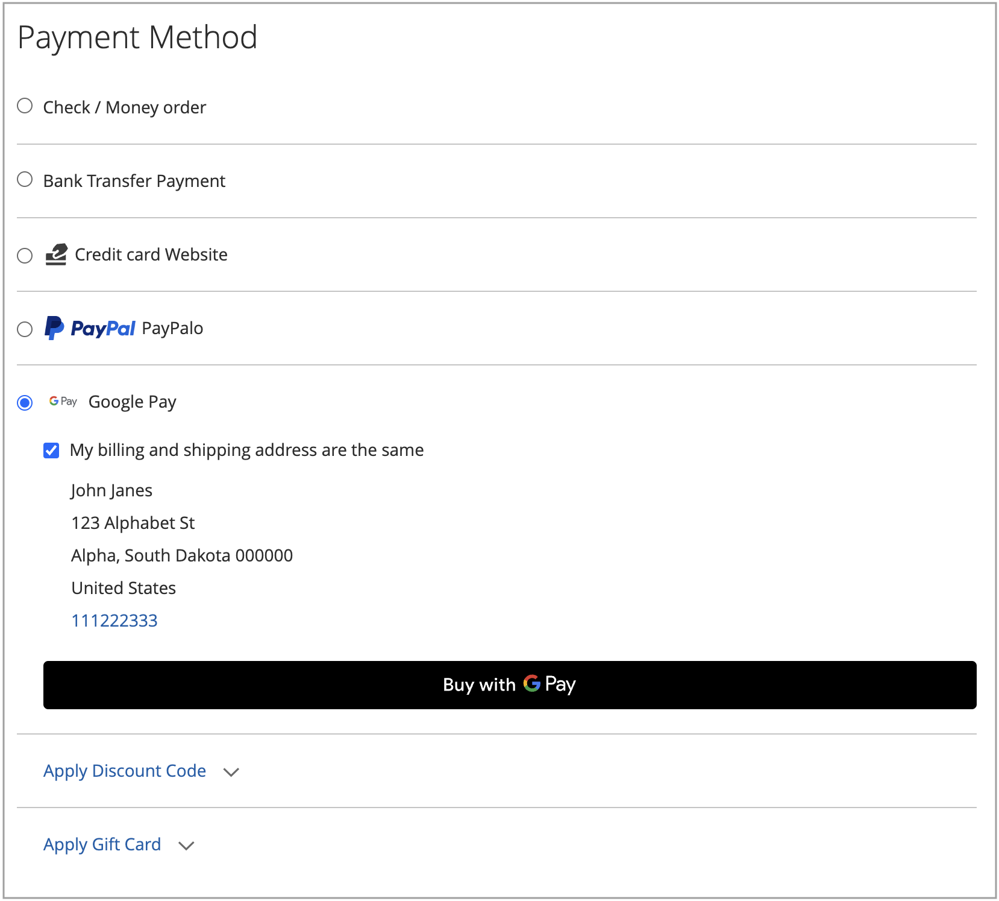

# Opções de pagamento

Com [!DNL Adobe Commerce] e [!DNL Magento Open Source] [!DNL Payment Services], você tem várias opções de pagamento disponíveis.

Você pode definir essas opções de pagamento em [Configurações da página inicial](payments-home.md) ou [Configuração da loja](configure-admin.md) (recomendado para opções de pagamento herdadas ou para uma configuração de várias lojas).

Há comportamentos diferentes para cada método de pagamento, dependendo de onde você está no processo de finalização:

* Página do produto — A página de produto de um item
* Minicarrinho — Disponível após clicar no ícone do carrinho quando um produto foi adicionado aos carrinhos
* Carrinho de compras — Disponível ao clicar em _Exibir e editar carrinho_ no minicarrinho
* Exibição de check-out — Disponível ao clicar em _Prosseguir para o check-out_ do minicarrinho ou carrinho de compras

>[!IMPORTANT]
>
>A integração do [!DNL Payment Services] deve ser concluída para que os pagamentos possam ser processados.

## Experiência de Pagamentos Padrão vs. Avançados

A [!DNL Payment Services] fornece opções de pagamento e fluxos de integração **Avançado** (com suporte total) e **Padrão** (Check-out Expresso), dependendo do país em que você opera.

* **Avançado** - Todas as [opções de pagamentos](../payment-services/payments-options.md) disponíveis estão disponíveis para os [países com suporte total](../payment-services/overview.md#availability) atuais. Durante a integração para habilitar pagamentos ao vivo, selecione a [opção de integração avançada](../payment-services/production.md#advanced-onboarding).
* **Padrão** - Um subconjunto de opções de pagamento (Check-out Expresso)—cartões de crédito e débito do PayPal—está disponível para outros países com suporte. [Os campos de cartão de crédito](#credit-card-fields) e [Pagamento Apple](#apple-pay-button) não estão disponíveis para esta opção de integração. Durante a integração para habilitar pagamentos ao vivo, selecione a [Opção de integração padrão](../payment-services/production.md#standard-onboarding).

Consulte [Habilitar [!DNL Payment Services] para produção](../payment-services/production.md#complete-merchant-onboarding) para obter informações sobre como concluir a integração avançada e padrão.

## [!UICONTROL Credit Card Fields]

[!UICONTROL Credit Card Fields] fornece um check-out simples e seguro para métodos de pagamento com cartão de crédito ou débito. Quando um comprador faz o check-out usando campos de cartão de crédito, ele insere seu nome, endereço de cobrança e informações de cartão de crédito ou débito para fazer seu pedido. As informações de seus clientes são usadas com segurança durante a sessão de compra para orientá-los perfeitamente pelo fluxo de finalização.

{width="500" zoomable="yes"}

Habilite o [cofre de cartão de crédito](#vaulting) para suas lojas para permitir que os compradores guardem (salvem) suas informações de cartão de crédito para um check-out rápido mais tarde.

Você pode configurar [!UICONTROL Credit Card Fields] na configuração do armazenamento ou na Página Inicial [!DNL Payment Services]. Consulte [Configurações](settings.md#credit-card-fields) para obter mais informações.

Também é possível alterar o layout, a largura, a altura e o estilo externo dos campos de cartão de crédito. Consulte a [documentação do PayPal](https://developer.paypal.com/docs/checkout/advanced/customize/card-field-style/) para obter mais informações.

## Botão [!DNL Apple Pay]

Os clientes podem usar o [[!DNL Apple Pay]](https://www.apple.com/apple-pay/), que usa credenciais de pagamento de cartão de crédito e débito armazenadas em um dispositivo iOS ou macOS, para fazer compras.

[!DNL Apple Pay] está disponível somente no navegador Safari. Os comerciantes podem adicionar até 99 domínios por conta de comerciante.

{width="500" zoomable="yes"}

O botão [!DNL Apple Pay] é visível na página do produto, no minicarrinho, no carrinho de compras e nas exibições de check-out.

Para usar o [!DNL Apple Pay] para suas lojas, conclua o [autorregistro com o [!DNL Apple Pay]](https://developer.paypal.com/docs/checkout/apm/apple-pay/#register-your-live-domain) (somente a seção _Registrar seu domínio dinâmico_) e o [configure-o para suas lojas no [!DNL Payment Services]](settings.md#payment-buttons).

>[!NOTE]
>
> Consulte [check-out avançado](https://www.paypal.com/us/cshelp/article/what-is-paypal-advanced-checkout-and-how-do-i-get-started-help953){target=_blank} na documentação do desenvolvedor do PayPal para verificar como habilitar os compradores para pagar com o Apple Pay no seu site.

Você pode configurar [!UICONTROL Apple Pay] na configuração da loja ou na Página Inicial dos Serviços de Pagamento. Consulte [Configurações](settings.md#apple-pay) para obter mais informações.

## Botão [!DNL Google Pay]

Os clientes podem usar o [[!DNL Google Pay]](https://pay.google.com/about/) adicionando detalhes de pagamento à sua Conta da Google, onde eles são armazenados com segurança para uma experiência de finalização de compra contínua.

O [!DNL Google Pay] está disponível somente em determinados países ou regiões e em determinados dispositivos. Consulte a [[!DNL Google Pay] documentação](https://developer.paypal.com/docs/checkout/apm/google-pay/#link-googlepayintegration) para obter mais informações.

{width="500" zoomable="yes"}

O botão [!DNL Google Pay] é visível na página do produto, no minicarrinho, no carrinho de compras e nas exibições de check-out.

Você pode configurar [!UICONTROL Google Pay] na configuração da loja ou na Página Inicial dos Serviços de Pagamento. Consulte [Configurações](configure-admin.md) para obter mais informações.

>[!NOTE]
>
> A API [!DNL Google Pay] só pode ser usada em sites em um contexto seguro. Consulte a documentação de [Solução de problemas](https://developers.google.com/pay/api/web/support/troubleshooting) para obter mais informações.

## [!DNL PayPal Payment Buttons]

O [!DNL PayPal payment buttons], que usa o PayPal para concluir uma compra, armazena o endereço de entrega, os endereços de cobrança e os detalhes de pagamento do comprador para uso posterior. Os compradores podem usar qualquer método de pagamento armazenado ou oferecido anteriormente pelo PayPal.

{width="350" zoomable="yes"}

Você pode configurar [!UICONTROL PayPal payment buttons] na configuração do armazenamento ou na Página Inicial [!DNL Payment Services]. Consulte [Configurações](settings.md#payment-buttons) para obter mais informações.

Saiba mais sobre a disponibilidade de métodos de pagamento por país na [Documentação de métodos de pagamento](https://developer.paypal.com/docs/checkout/payment-methods/) do PayPal.

### Botão [!DNL PayPal]

Os clientes podem fazer check-out com facilidade e confiança usando o botão PayPal.

O botão [!DNL PayPal] é visível na página do produto, no minicarrinho, no carrinho de compras e nas exibições de check-out.

### Botão [!DNL Venmo]

Os clientes podem fazer check-out usando o botão [Venmo](https://venmo.com/).

O botão [!DNL Venmo] é visível na página do produto, no minicarrinho, no carrinho de compras e nas exibições de check-out.

### Botão Cartão de crédito ou débito do PayPal

Os clientes podem fazer check-out usando o botão PayPal Débito ou Cartão de crédito.

O botão PayPal Debit or Credit card (Cartão de crédito ou débito do PayPal) está visível na página de check-out.

Esta opção pode ser usada para apresentar uma opção de pagamento com cartão de crédito ou débito aos seus compradores com um botão hospedado no PayPal, como alternativa à integração com cartão de crédito.

### Botão [!DNL Pay Later]

Ofereça aos clientes pagamentos a curto prazo, sem juros e outras opções de financiamento para que eles possam comprar agora e pagar depois com o botão [!DNL Pay Later].

O botão [!DNL Pay Later] é visível na página do produto, no minicarrinho, no carrinho de compras e nas exibições de check-out.

Consulte informações sobre as ofertas do Pay Later na [documentação de ofertas do PayPal do PayPal](https://developer.paypal.com/docs/checkout/pay-later/us/). Use a lista suspensa **País ou região** para selecionar uma região de interesse.

Saiba como desabilitar ou habilitar as mensagens de [!DNL Pay Later] atualizando a configuração [Configurações](settings.md#payment-buttons).

## Usar somente botões de pagamento do PayPal

Para colocar rapidamente sua loja em modo de produção, você pode configurar _somente_ botões de pagamento do PayPal (Venmo, PayPal e assim por diante).—em vez de também usar a opção de pagamento com cartão de crédito PayPal.

Isso permite:

* Forneça várias opções de pagamento para seus clientes, incluindo os botões de pagamento Venmo e PayPal, com a opção de desativar os campos de cartão hospedado no PayPal e usar um provedor de cartão de crédito existente.
* Use seu fornecedor de cartão de crédito existente para pagamentos com cartão de crédito, ao mesmo tempo que usa outras opções de pagamento do PayPal.
* Use os botões de pagamento do PayPal em regiões onde o PayPal não oferece suporte a cartões de crédito como uma opção de pagamento.

Para **capturar pagamentos com _somente_ botões de pagamento do PayPal (_não_ a opção de pagamento com cartão de crédito do PayPal)**:

1. Certifique-se de que seu repositório esteja [no modo de produção](settings.md#enable-payment-services).
1. [Configure os botões de pagamento do PayPal desejados](settings.md#payment-buttons) em Configurações.
1. Desative _a opção **[[!UICONTROL Show PayPal Credit and Debit card button]](settings.md#payment-buttons)**&#x200B;na seção&#x200B;_[!UICONTROL Payment buttons]_._

Para **capturar pagamentos com seu provedor de cartão de crédito existente _e_ botões de pagamento do PayPal**:

1. Certifique-se de que seu repositório esteja [no modo de produção](settings.md#enable-payment-services).
1. [Configure os botões de pagamento do PayPal desejados](settings.md#payment-buttons).
1. Desative _a opção **[[!UICONTROL PayPal Show Credit and Debit card button]](settings.md#payment-buttons)**&#x200B;na seção&#x200B;_[!UICONTROL Payment buttons]_._
1. Desative _a opção **[[!UICONTROL Show on checkout page]](settings.md#credit-card-fields)**&#x200B;na seção&#x200B;_[!UICONTROL Credit card fields]_ e use sua [conta de provedor de cartão de crédito existente](https://experienceleague.adobe.com/docs/commerce-admin/stores-sales/payments/payments.html#payments)._

## Recálculo de pedido

Quando um cliente entra no fluxo de finalização do minicarrinho, carrinho de compras ou página do produto, ele é direcionado a uma página de revisão do pedido, onde pode ver o endereço de envio selecionado em uma janela pop-up do PayPal. Depois que o cliente selecionar o método de entrega, a quantia da ordem será recalculada apropriadamente e o cliente poderá ver os custos e impostos de entrega.

Quando um cliente entra no fluxo de finalização da página de finalização da compra, o sistema já sabe o endereço de entrega e o valor final calculado, e os totais são devidamente representados.

Feriados fiscais, custos de envio e imposto sobre vendas podem variar amplamente de local para local. Depois que [!DNL Payment Services] receber o endereço e a taxa de remessa, ele recalcula rapidamente todos os custos aplicáveis e os exibe adequadamente durante os últimos estágios da finalização.

## Compartimentalização de cartão de crédito

Os compradores podem arquivar (ou &quot;salvar&quot;) suas informações de cartão de crédito para compras futuras no nível do site (qualquer loja na conta do mesmo comerciante).

Consulte [Compartimentalização de cartão de crédito](vaulting.md) para obter mais informações.

## Segurança

Consulte [Conformidade com a PCI](security.md#pci-compliance) para obter mais informações.
