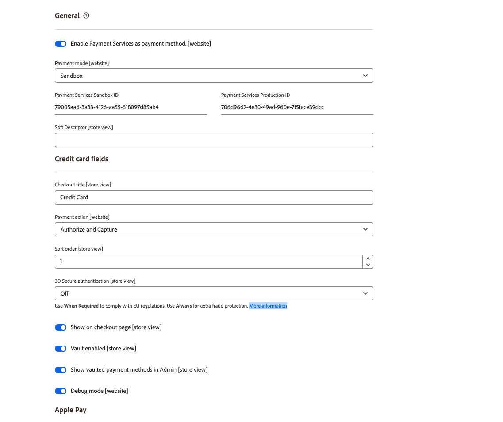

# Configurações

Você pode personalizar o [!DNL Payment Services] de acordo com suas necessidades com configurações úteis na Página Inicial do [!DNL Payment Services].

Para configurar o [!DNL Payment Services] para [!DNL Adobe Commerce] e [!DNL Magento Open Source], clique em **[!UICONTROL Settings]**. Essas opções de configuração se aplicam somente ao ambiente definido no campo _[!UICONTROL Payment mode]_&#x200B;das[_ Opções de configuração _gerais](#configure-general-settings).

Para configurações herdadas ou de vários armazenamentos, consulte [Configurar no Admin](configure-admin.md).

## Definir configurações gerais

As configurações do [!UICONTROL General] permitem habilitar ou desabilitar Serviços de Pagamento como método de pagamento e adicionar informações às transações do cliente para marcar ou adicionar um modo de exibição de site ou loja com informações personalizadas como prefixo.

### Habilitar Serviços de Pagamento

Você pode habilitar [!DNL Payment Services] para o seu site e habilitar testes de sandbox ou pagamentos ao vivo.

1. Na barra lateral _Admin_, vá para **[!UICONTROL Sales]** > **[!UICONTROL Payment Services]**.

1. Clique em **[!UICONTROL Settings]**. Consulte [Introdução à [!DNL Payment Services] Página inicial](payments-home.md) para obter mais informações.

   {width="500" zoomable="yes"}

   A seção _[!UICONTROL General]_&#x200B;inclui configurações usadas para habilitar [!DNL Payment Services] como o método de pagamento.

1. Para habilitar [!DNL Payment Services] como método de pagamento para sua loja, na seção _[!UICONTROL General]_, alterne **[!UICONTROL Enable Payment Services as payment method]**&#x200B;para `Yes`.

1. Se você ainda estiver testando [!DNL Payment Services] para sua loja, defina **Modo de pagamento** como `Sandbox`. Se você estiver pronto para habilitar pagamentos ao vivo, defina-os como `Production`.

1. Os valores **[!UICONTROL Payment Services Sandbox ID]** e **[!UICONTROL Payment Services Production ID]** são preenchidos automaticamente depois que você configura o [Commerce Services Connector](https://experienceleague.adobe.com/pt-br/docs/commerce-merchant-services/user-guides/integration-services/saas){target=_blank} e visita o painel [!DNL Payment Services] pela primeira vez. Faça isso para concluir a integração dos ambientes de sandbox e/ou produção. Esses valores associam sua SaaS ID a [!DNL Payment Services].

   >[!WARNING]
   >
   > Se você redefinir suas [!DNL Payment Services] IDs, será necessário integrar novamente.

1. Clique em **[!UICONTROL Save]**.

   Se você tentar sair dessa visualização sem salvar as alterações, será exibido um modal que solicitará que você descarte as alterações, continue editando ou salve as alterações.

1. Navegue até **[!UICONTROL System]** > **[!UICONTROL Cache Management]** e clique em **[!UICONTROL Flush Cache]** para atualizar todos os caches inválidos.

Agora você pode alterar as configurações padrão para funções de [opções de pagamento](#configure-payment-options) e exibição de vitrine eletrônica.

### Adicionar descritor simples

Você pode adicionar um [!UICONTROL Soft Descriptor] à configuração do(s) seu(s) site(s) ou exibição(ões) de loja individual. Os descritores flexíveis são exibidos nos demonstrativos bancários de transação do cliente. Se você tiver várias lojas/marcas/catálogos, por exemplo, é possível definir facilmente entre eles adicionando texto personalizado ao campo [!UICONTROL Soft Descriptor].

1. Na barra lateral _Admin_, vá para **[!UICONTROL Sales]** > **[!UICONTROL Payment Services]**.
1. Clique em **[!UICONTROL Settings]**. Consulte [Introdução à [!DNL Payment Services] Página inicial](payments-home.md) para obter mais informações.
1. Selecione o modo de exibição de site ou loja, no menu suspenso **[!UICONTROL Scope]**, para o qual você deseja criar um descritor simples. Para configuração inicial, deixe como **[!UICONTROL Default]** para definir o valor padrão.
1. Adicione seu texto personalizado (até 22 caracteres) no campo de texto, substituindo `Soft descriptor`.
1. Clique em **[!UICONTROL Save]**.
1. Para criar um descritor simples que não seja o padrão configurado para uma exibição de site ou loja:
   1. Selecione o modo de exibição de site ou loja, no menu suspenso **[!UICONTROL Scope]**, para o qual você deseja criar um descritor simples.
   1. Alternar _desligado_ **[!UICONTROL Use website]** (ou **[!UICONTROL Use default]**, dependendo do escopo selecionado).
   1. Adicione seu texto personalizado no campo de texto.
   1. Clique em **[!UICONTROL Save]**.
1. Para habilitar para um site ou exibição de loja, o descritor flexível padrão _ou_, o descritor flexível usado para o site pai:
   1. Selecione o modo de exibição de site ou loja, no menu suspenso **[!UICONTROL Scope]**, para o qual você deseja habilitar um descritor simples existente.
   1. Alternar _em_ **[!UICONTROL Use website]** (ou **[!UICONTROL Use default]**, dependendo do escopo selecionado).
   1. Clique em **[!UICONTROL Save]**.

   Se você tentar sair dessa visualização sem salvar as alterações, será exibido um modal que solicitará que você descarte as alterações, continue editando ou salve as alterações.

### Opções de configuração

| Campo | Escopo | Descrição |
|---|---|---|
| [!UICONTROL Enable] | site | Habilite ou desabilite o [!DNL Payment Services] para o seu site. Opções: [!UICONTROL Off] / [!UICONTROL On] |
| [!UICONTROL Payment mode] | exibição de loja | Defina o método ou ambiente para sua loja. Opções: [!UICONTROL Sandbox] / [!UICONTROL Production] |
| [!UICONTROL Payment Services Sandbox ID] | exibição de loja | Sua ID de comerciante de sandbox, que é gerada automaticamente durante a integração da sandbox. |
| [!UICONTROL Payment Services Production ID] | exibição de loja | Sua ID de comerciante de produção, que é gerada automaticamente durante a integração da produção (ao vivo). |
| [!UICONTROL Soft Descriptor] | exibição de site ou loja | Adicione um descritor simples ao(s) site(s) e às visualizações da loja para adicionar informações às transações do cliente que definem marcas, lojas ou linhas de produtos. A opção [!UICONTROL Use website] aplica qualquer descritor simples adicionado no nível do site. A opção [!UICONTROL Use default] aplica qualquer descritor simples adicionado como padrão. |

## Configurar opções de pagamento

Agora que você habilitou [!UICONTROL Payment Services] para o seu site, é possível alterar as configurações padrão para funções de pagamento e exibição de vitrine eletrônica.

1. Na barra lateral _Admin_, vá para **[!UICONTROL Sales]** > **[!UICONTROL Payment Services]**.
1. Clique em **[!UICONTROL Settings]**. Consulte [Introdução à [!DNL Payment Services] Página inicial](payments-home.md) para obter mais informações.
1. Configure as opções de pagamento para [cartões de crédito](#credit-card-fields), [botões de pagamento](#payment-buttons) e [estilo de botão](#button-style), de acordo com as seções a seguir.

### Campos de cartão de crédito

As configurações do _[!UICONTROL Credit Card Fields]_&#x200B;fornecem uma opção de check-out simples e segura para métodos de pagamento com cartão de crédito ou débito.

Consulte [Opções de pagamentos](payments-options.md#credit-card-fields) para obter mais informações.

1. Na barra lateral _Admin_, vá para **[!UICONTROL Sales]** > **[!UICONTROL Payment Services]**.
1. Selecione a exibição de loja, no menu suspenso **[!UICONTROL Scope]**, para a qual você deseja habilitar um método de pagamento.
1. Na seção **[!UICONTROL Credit card fields]**, edite o valor no campo **[!UICONTROL Checkout title]** para alterar o nome do método de pagamento exibido durante o check-out.
1. Para [definir a ação de pagamento](production.md#set-payment-services-as-payment-method), alterne **[!UICONTROL Payment action]** para `Authorize` ou `Authorize and Capture`.
1. Para priorizar um método de pagamento na página de check-out, forneça um valor `Numeric Only` no campo **[!UICONTROL Sort order]**.
1. Para habilitar a [Autenticação Segura do 3DS](security.md#3ds) (`Off` por padrão), alterne o seletor **[!UICONTROL 3DS Secure authentication]** para `Always` ou `When required`.
1. Para ativar ou desativar campos de cartão de crédito na página de check-out, alterne o seletor **[!UICONTROL Show on checkout page]**.
1. Para habilitar ou desabilitar a [compartimentalização de cartão](#card-vaulting), alterne o seletor **[!UICONTROL Vault enabled]**.
1. Para habilitar ou desabilitar [métodos de pagamento com cofre no Administrador](#card-vaulting) (para que os comerciantes concluam pedidos de clientes no Administrador usando o método de pagamento com cofre), alterne o seletor **[!UICONTROL Show vaulted methods in Admin]**.
1. Para ativar ou desativar o modo de depuração, alterne o seletor **[!UICONTROL Debug Mode]**.
1. Clique em **[!UICONTROL Save]**.

   Se você tentar sair dessa visualização sem salvar as alterações, será exibido um modal que solicitará que você descarte as alterações, continue editando ou salve as alterações.

1. [Limpar o cache](#flush-the-cache).

#### Opções de configuração

| Campo | Escopo | Descrição |
|---|---|---|
| [!UICONTROL Title] | exibição de loja | Adicione o texto para exibição como o título desta opção de pagamento na exibição de Método de Pagamento durante a finalização da compra. Opções: [!UICONTROL text field] |
| [!UICONTROL Payment Action] | site | A [ação de pagamento](https://experienceleague.adobe.com/pt-br/docs/commerce-admin/config/sales/payment-methods/payment-methods#payment-actions){target="_blank"} para o método de pagamento especificado. Opções: [!UICONTROL Authorize] / [!UICONTROL Authorize and Capture] |
| [!UICONTROL Sort order] | exibição de loja | A ordem de classificação do método de pagamento especificado na página de check-out. Valor `Numeric Only` |
| [!UICONTROL 3DS Secure authentication] | site | Habilite ou desabilite a [autenticação Segura do 3DS](security.md#3ds). Opções: [!UICONTROL Always] / [!UICONTROL When Required] / [!UICONTROL Off] |
| [!UICONTROL Show on checkout page] | site | Ative ou desative os campos de cartão de crédito para serem exibidos na página de check-out. Opções: [!UICONTROL Off] / [!UICONTROL On] |
| [!UICONTROL Vault enabled] | exibição de loja | Habilite ou desabilite o [cofre de cartão de crédito](vaulting.md). Opções: [!UICONTROL Off] / [!UICONTROL On] |
| [!UICONTROL Show vaulted payment methods in Admin] | exibição de loja | Habilite ou desabilite a capacidade do comerciante de concluir pedidos de clientes no Administrador [usando um método de pagamento com cofre](vaulting.md). Opções: [!UICONTROL Off] / [!UICONTROL On] |
| [!UICONTROL Debug Mode] | site | Ative ou desative o Modo de depuração. Opções: [!UICONTROL Off] / [!UICONTROL On] |

### Apple Pay

A opção de pagamento com botão [!UICONTROL Apple Pay] permite fornecer um botão de pagamento [!UICONTROL Apple Pay] no check-out da loja pelo navegador Safari (para até 99 domínios por conta de comerciante).

Você só poderá usar o Apple Pay se concluir o [autorregistro do Apple Pay via Paypal](https://developer.paypal.com/docs/checkout/apm/apple-pay/#register-your-live-domain) e depois [configurar o Apple Pay](settings.md/#payment-buttons) para suas lojas. Consulte [Opções de pagamentos](payments-options.md#apple-pay-button) para obter mais informações.

Você pode habilitar e configurar a opção de pagamento do botão [!UICONTROL Apple Pay]:

1. Na barra lateral _Admin_, vá para **[!UICONTROL Sales]** > **[!UICONTROL Payment Services]**.
1. Selecione a exibição de loja, no menu suspenso **[!UICONTROL Scope]**, para a qual você deseja habilitar um método de pagamento.
1. Na seção **[!UICONTROL Apple Pay]**, edite o valor no campo _[!UICONTROL Checkout title]_&#x200B;para alterar o nome do método de pagamento exibido durante o check-out.
1. Para [definir a ação de pagamento](production.md#set-payment-services-as-payment-method), alterne **[!UICONTROL Payment action]** para `Authorize` ou `Authorize and Capture`.
1. Para habilitar ou desabilitar o Apple Pay na página de check-out, alterne o seletor **[!UICONTROL Show Apple Pay on checkout page]**.
1. Para habilitar ou desabilitar o Apple Pay na página de detalhes do produto, alterne o seletor **[!UICONTROL Show Apple Pay on product detail page]**.
1. Para ativar ou desativar o Apple Pay na visualização do minicarrinho, alterne o seletor **[!UICONTROL Show Apple Pay on the mini cart preview]**.
1. Para ativar ou desativar o Apple Pay na página do carrinho, alterne o seletor **[!UICONTROL Show Apple Pay on cart page]**.
1. Para ativar ou desativar o modo de depuração, alterne o seletor **[!UICONTROL Debug Mode]**.
1. Clique em **[!UICONTROL Save]**.

   Se você tentar sair dessa visualização sem salvar as alterações, será exibido um modal que solicitará que você descarte as alterações, continue editando ou salve as alterações.

1. [Limpar o cache](#flush-the-cache).

#### Opções de configuração

| Campo | Escopo | Descrição |
|---|---|---|
| [!UICONTROL Checkout title] | exibição de loja | Adicione o texto para exibição como o título desta opção de pagamento na exibição de Método de Pagamento durante a finalização da compra. Opções: [!UICONTROL text field] |
| [!UICONTROL Payment Action] | site | A [ação de pagamento](https://experienceleague.adobe.com/pt-br/docs/commerce-admin/config/sales/payment-methods/payment-methods#payment-actions) para o método de pagamento especificado. Opções: [!UICONTROL Authorize] / [!UICONTROL Authorize and Capture] |
| [!UICONTROL Show on checkout page] | site | Ative ou desative o botão Apple Pay para mostrar na página de finalização. Opções: [!UICONTROL Off] / [!UICONTROL On] |
| [!UICONTROL Show on checkout page] | site | Ative ou desative o botão Apple Pay para mostrar na página de detalhes do produto. Opções: [!UICONTROL Off] / [!UICONTROL On] |
| [!UICONTROL Show on mini cart preview] | site | Ative ou desative o botão Apple Pay para exibir na pré-visualização do mini carrinho. Opções: [!UICONTROL Off] / [!UICONTROL On] |
| [!UICONTROL Show on cart page] | site | Ative ou desative o botão Apple Pay para mostrar na página do carrinho. Opções: [!UICONTROL Off] / [!UICONTROL On] |
| [!UICONTROL Debug Mode] | site | Ative ou desative o Modo de depuração. Opções: [!UICONTROL Off] / [!UICONTROL On] |

### Botões de pagamento

As opções de pagamento do [!DNL PayPal payment buttons] oferecem ao seu cliente um processo de finalização simples, rápido e seguro. Consulte [Opções de pagamentos](payments-options.md#paypal-smart-buttons) para obter mais informações.

Você pode ativar e configurar as opções de pagamento dos botões de pagamento do PayPal:

1. Selecione a exibição de loja, no menu suspenso **[!UICONTROL Scope]**, para a qual você deseja habilitar um método de pagamento.
1. Para alterar o nome do método de pagamento conforme mostrado durante o check-out, edite o valor no campo **[!UICONTROL Checkout Title]**.
1. Para [definir a ação de pagamento](production.md#set-payment-services-as-payment-method), alterne **[!UICONTROL Payment action]** para `Authorize` ou `Authorize and Capture`.
1. Para priorizar um método de pagamento na página de check-out, forneça um valor `Numeric Only` no campo **[!UICONTROL Sort order]**.
1. Use os seletores de alternância para habilitar ou desabilitar os recursos de exibição do [!DNL PayPal smart button]:

   - **[!UICONTROL Show PayPal buttons on product checkout page]**
   - **[!UICONTROL Show PayPal buttons on product detail page]**
   - **[!UICONTROL Show PayPal buttons in mini-cart preview]**
   - **[!UICONTROL Show PayPal buttons on cart page]**
   - **[!UICONTROL Show PayPal Pay Later button]**
   - **[!UICONTROL Show PayPal Pay Later message]**
   - **[!UICONTROL Show Venmo button]**
   - **[!UICONTROL Show Apple Pay button]**
   - **[!UICONTROL Show PayPal Credit and Debit Card button]**

     >[!NOTE]
     >
     > Para usar o Apple Pay, você [deve ter uma conta de testador de sandbox da Apple](https://developer.apple.com/apple-pay/sandbox-testing/#create-a-sandbox-tester-account) (completa com informações falsas de cartão de crédito e cobrança) para testá-la. Quando estiver pronto para usar o Apple Pay no modo de produção sandbox _ou_, após concluir qualquer [teste e validação](test-validate.md#test-in-sandbox-environment), conclua o [autorregistro com [!DNL Apple Pay]](https://developer.paypal.com/docs/checkout/apm/apple-pay/#register-your-live-domain) (_Registre somente a seção domínio ativo_) e [configure-o para suas lojas no [!DNL Payment Services]](settings.md#payment-buttons).

     À medida que você alterna a visibilidade de ativação/desativação para botões de pagamento ou a mensagem PayPal Pay Later (Pagar mais tarde no PayPal), uma visualização visual dessa configuração é exibida na parte inferior da página Configurações.

1. Para habilitar o modo de depuração, alterne o seletor **[!UICONTROL Debug Mode]**.
1. Clique em **[!UICONTROL Save]**.

   Se você tentar sair dessa visualização sem salvar as alterações, será exibido um modal que solicitará que você descarte as alterações, continue editando ou salve as alterações.

1. [Limpar o cache](#flush-the-cache).

#### Opções de configuração

| Campo | Escopo | Descrição |
|---|---|---|
| [!UICONTROL Title] | exibição de loja | Adicione o texto a ser exibido como o título para esta opção de pagamento na exibição de Método de Pagamento durante a finalização da compra. Opções: campo de texto |
| [!UICONTROL Payment Action] | site | A [ação de pagamento](https://experienceleague.adobe.com/pt-br/docs/commerce-admin/config/sales/payment-methods/payment-methods#payment-actions){target="_blank"} para o método de pagamento especificado. Opções: [!UICONTROL Authorize] / [!UICONTROL Authorize and Capture] |
| [!UICONTROL Sort order] | exibição de loja | A ordem de classificação do método de pagamento especificado na página de check-out. Valor `Numeric Only` |
| [!UICONTROL Show PayPal buttons on checkout page] | exibição de loja | Habilite ou desabilite [!DNL PayPal payment buttons] na página de check-out. Opções: [!UICONTROL &#x200B; Yes] / [!UICONTROL No] |
| [!UICONTROL Show PayPal buttons on product detail page] | exibição de loja | Habilite ou desabilite [!DNL PayPal payment buttons] na página de detalhes do produto. Opções: [!UICONTROL &#x200B; Yes] / [!UICONTROL No] |
| [!UICONTROL Show PayPal buttons in mini-cart preview] | exibição de loja | Habilite ou desabilite [!DNL PayPal payment buttons] na visualização do minicarrinho. Opções: [!UICONTROL Off] / [!UICONTROL On] |
| [!UICONTROL Show PayPal buttons on cart page] | exibição de loja | Habilite ou desabilite [!DNL PayPal payment buttons] na página do carrinho. Opções: [!UICONTROL Off] / [!UICONTROL On] |
| [!UICONTROL Show PayPal Pay Later button] | exibição de loja | Ativar ou desativar a aparência da opção de pagamento pagar mais tarde, onde os botões de pagamento são exibidos. Opções: [!UICONTROL Off] / [!UICONTROL On] |
| [!UICONTROL Show PayPal Pay Later Message] | site | Ative ou desative a mensagem Pagar mais tarde no carrinho de compras, página do produto, minicarrinho e durante o fluxo de finalização. Opções: [!UICONTROL Off] / [!UICONTROL On] |
| [!UICONTROL Show Venmo button] | exibição de loja | Habilite ou desabilite a opção de pagamento Venmo onde os botões de pagamento são exibidos. Opções: [!UICONTROL Off] / [!UICONTROL On] |
| [!UICONTROL Show Apple Pay button] | exibição de loja | Ative ou desative a opção Pagamento Apple onde os botões de pagamento são exibidos. Opções: [!UICONTROL Off] / [!UICONTROL On] |
| [!UICONTROL Show PayPal Credit and Debit card button] | exibição de loja | Ative ou desative a opção de pagamento com cartão de Crédito e Débito onde os botões de pagamento são exibidos. Opções: [!UICONTROL Off] / [!UICONTROL On] |
| [!UICONTROL Debug Mode] | site | Ative ou desative o Modo de depuração. Opções: [!UICONTROL Off] / [!UICONTROL On] |

### Estilo do botão

Você também pode configurar as opções _[!UICONTROL Button style]_&#x200B;dos botões de pagamento:

1. Para alterar o **[!UICONTROL Layout]**, selecione `Vertical` ou `Horizontal`.

   >[!NOTE]
   >
   > Se o estilo do botão estiver configurado como `Horizontal` e sua loja estiver configurada para mostrar vários botões de pagamento, você só poderá ver dois botões exibidos na página do produto, na página de check-out e no minicarrinho, e um botão exibido no carrinho.

1. Para habilitar o slogan em um layout horizontal, alterne o seletor **[!UICONTROL Show tagline]**.
1. Para modificar o **[!UICONTROL Color]**, selecione a opção de cor desejada.
1. Para modificar o **[!UICONTROL Shape]**, selecione `Pill` ou `Rectangle`.
1. Para ativar o seletor de altura do botão, alterne o seletor **[!UICONTROL Responsive button height]**.
1. Para modificar o **[!UICONTROL Label]**, selecione a opção de rótulo desejada.

   À medida que você altera as opções de configuração de layout, cor, forma, altura e rótulo, uma visualização visual dessa configuração é exibida na parte inferior da página Configurações. Na imagem abaixo, **[!UICONTROL Shape]** está definido como _Retângulo_ e **[!UICONTROL Label]** está definido como _PayPal (recomendado)_.

   ![[!DNL PayPal payment buttons] opções](assets/payment-buttons.png){width="400" zoomable="yes"}

1. Clique em **[!UICONTROL Save]**.

   Se você tentar sair dessa visualização sem salvar as alterações, será exibido um modal que solicitará que você descarte as alterações, continue editando ou salve as alterações.

1. [Limpar o cache](#flush-the-cache).

Você pode configurar o estilo do botão de pagamento [na configuração Herdada em Admin](configure-admin.md#configure-paypal-smart-buttons) ou aqui em [!DNL Payment Services Home]. Consulte [Guia de estilo de Botões do PayPal](https://developer.paypal.com/docs/checkout/standard/customize/buttons-style-guide/) para obter mais informações sobre como estilizar botões de pagamento do PayPal.

#### Opções de configuração

| Campo | Escopo | Descrição |
|--- |--- |--- |
| [!UICONTROL Layout] | Exibição da loja | Definir estilo de layout para botões de pagamento. Opções: [!UICONTROL Vertical] / [!UICONTROL Horizontal] |
| [!UICONTROL Tagline] | Exibição da loja | Ativar/desativar slogan. Opções: [!UICONTROL Off] / [!UICONTROL On] |
| [!UICONTROL Color] | Exibição da loja | Defina a cor dos botões de pagamento. Opções: [!UICONTROL Blue] / [!UICONTROL Gold] / [!UICONTROL Silver] / [!UICONTROL White] / [!UICONTROL Black] |
| [!UICONTROL Shape] | Exibição da loja | Definir a forma dos botões de pagamento. Opções: [!UICONTROL Rectangular] / [!UICONTROL Pill] |
| [!UICONTROL Responsive Button Height] | Exibição da loja | Define se os botões de pagamento usarão uma altura padrão. Opções: [!UICONTROL Off] / [!UICONTROL On] |
| [!UICONTROL Height] | Exibição da loja | Defina a altura dos botões de pagamento. Valor padrão: nenhum |
| [!UICONTROL Label] | Exibição da loja | Defina o rótulo que aparece nos botões de pagamento. Opções: [!UICONTROL PayPal] / [!UICONTROL Checkout] / [!UICONTROL Buynow] / [!UICONTROL Pay] / [!UICONTROL Installment] |

## Configurar funções

Para garantir que os usuários Administradores possam criar e gerenciar pedidos no Administrador do Commerce, habilite os recursos específicos do [!DNL Payment Services] para funções de usuário.

Consulte [Funções de usuário](https://experienceleague.adobe.com/docs/commerce-admin/systems/user-accounts/permissions-user-roles.html?lang=pt-BR) para saber como gerenciar funções.

Ao atribuir recursos à função, você deve selecionar:

- **Pagar com[!DNL Payment Services]** — Esse recurso garante que, ao criar um pedido no Administrador, [!DNL Payment Services] cartões de crédito estejam disponíveis como um método de pagamento. Se você selecionar o recurso pai **Ações**, esse recurso também será selecionado.
- **[!DNL Payment Services]**—Este recurso inclui os recursos **Dashboard** e **Proxy de Serviços SaaS**, que também devem ser selecionados. Eles garantem que [!DNL Payment Services] apareça no menu _Vendas_.

  {width="400" zoomable="yes"}

## Liberar o cache

Se você alterar a configuração em _Configurações_, por exemplo, alternando os botões Apple Pay, Venmo ou PayPal PayLater, limpe manualmente o cache para que sua loja mostre as configurações mais recentes.

1. Na barra lateral _Admin_, vá para **[!UICONTROL System]** > **[!UICONTROL Cache Management]**.
1. Clique em **[!UICONTROL Flush Cache]** para atualizar todos os caches inválidos.

Se qualquer Tipo de Cache na tabela Gerenciamento de Cache tiver um status `INVALIDATED`, seu repositório talvez não mostre a configuração mais recente para esse item. Limpe o cache para atualizar seu armazenamento para mostrar a configuração mais recente.

Para garantir que seu armazenamento mostre a configuração correta, [limpe o cache](https://experienceleague.adobe.com/pt-br/docs/commerce-admin/systems/tools/cache-management) periodicamente.

## Compartimentalização da placa

Você pode ativar a funcionalidade que permite aos clientes arquivar — ou &quot;salvar&quot; — as informações de cartão de crédito em sua conta para uso em compras futuras.

Você também pode usar a compartimentalização de cartão no Administrador para concluir pedidos subsequentes de clientes existentes.

Habilite ou desabilite a compartimentalização de cartão nas [configurações de campo de cartão de crédito](#credit-card-fields).

Consulte [Compartimentalização de cartão de crédito](vaulting.md) para obter mais informações.

## 3DS

O 3DS protege clientes e comerciantes de atividades fraudulentas em suas lojas e permite a conformidade com os padrões da União Europeia (UE).

Habilite ou desabilite o 3DS nas [Configurações do campo de cartão de crédito](#credit-card-fields).

Consulte [3DS em Segurança](security.md#3ds) para obter mais informações.

## Usar várias contas do PayPal

No [!UICONTROL Payment Services], você pode usar várias contas do PayPal em **uma** conta de comerciante no nível do site. Por exemplo, se você estiver operando sua(s) loja(s) em vários países (que usam [moedas](https://experienceleague.adobe.com/pt-br/docs/commerce-admin/stores-sales/site-store/currency/currency) diferentes) ou se quiser usar o Adobe Commerce para algumas partes de sua empresa, mas não _todas_, é possível configurar sua conta de comerciante para usar várias contas do PayPal.

Consulte [Escopo de Site, Armazenamento e Exibição](https://experienceleague.adobe.com/docs/commerce-admin/start/setup/websites-stores-views.html?lang=pt-BR) para obter mais informações sobre a hierarquia de sites, lojas e exibições de loja.

Consulte [Configuração de linha de comando](configure-cli.md#configure-scope-via-cli) para obter mais informações sobre a configuração de escopos para várias contas do PayPal via CLI.

Seu representante de vendas pode criar um novo [escopo](https://experienceleague.adobe.com/docs/commerce-admin/start/setup/websites-stores-views.html?lang=pt-BR#scope-settings) para sua conta de comerciante e integrar o site adicional com o PayPal para que qualquer um dos botões do PayPal que você configura para aparecer apareça em seu site. Entre em contato com o representante de vendas para obter assistência com o uso de várias contas do PayPal para seus sites.
