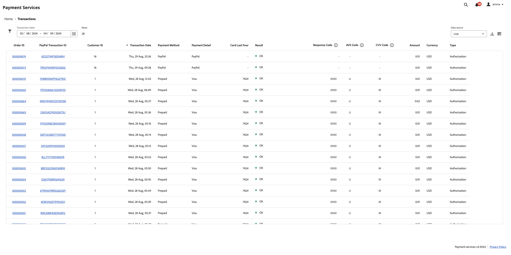

# Relatório de Transações

O [!DNL Payment Services] for [!DNL Adobe Commerce] e [!DNL Magento Open Source] oferece relatórios abrangentes para você ter uma visão clara das transações, ordens e pagamentos da sua loja.

{width="700" zoomable="yes"}

O relatório de Transações oferece visibilidade sobre taxas de autorização de transações e tendências de transações negativas, para que você possa monitorar efetivamente a integridade do armazenamento e identificar e resolver quaisquer problemas de transação.

Consulte transações individuais para pedidos colocados na loja e seus métodos de pagamento, resultado, códigos de resposta de pagamento e muito mais.

As informações fornecidas no relatório de Transações se destinam apenas ao uso comercial. Não compartilhe essas informações com clientes ou outros possíveis fraudadores. As informações sobre transações podem ser usadas para ignorar as verificações de segurança ou fazer pedidos que resultem em substituições de débitos.

Você pode fazer download do relatório de Transações em um formato de arquivo .csv para uso em software de contabilidade ou gerenciamento de pedidos existente.

>[!NOTE]
>
>Você não pode exibir relatórios financeiros se não tiver [o modo Online integrado e ativado](production.md#enable-live-payments) para [!DNL Payment Services].

## Exibição do relatório de transações

A visualização do relatório Transações está disponível na visualização Transações dos Serviços de pagamento. Inclui todas as informações disponíveis sobre transações para sua(s) loja(s).

Na barra lateral _Admin_, vá para **[!UICONTROL Sales]** > **[!UICONTROL Payment Services]** > _[!UICONTROL Transactions]_>**[!UICONTROL View Report]**&#x200B;para ver a exibição detalhada do relatório de Transações em tabela.

{width="800" zoomable="yes"}

É possível configurar essa visualização, de acordo com as seções neste tópico, para apresentar melhor os dados que você deseja ver.

Consulte ordem vinculada do Commerce e IDs de transação do PayPal, valores de transação, método de pagamento por transação e muito mais, tudo neste relatório.

Nem todos os métodos de pagamento fornecem a mesma granularidade de informações. Por exemplo, transações de cartão de crédito fornecem resposta, AVS, e códigos CCV, e os últimos quatro dígitos do cartão no relatório de Transações; botões de pagamento PayPal não.

Você pode [baixar transações](#download-transactions) em um formato de arquivo .csv para uso em software de contabilidade ou gerenciamento de pedidos existente.

>[!WARNING]
>
> O relatório de transações não incluirá nenhuma captura feita fora de [!DNL Payment Services].

### Selecionar fonte de dados

Na exibição de relatório Transações, você pode selecionar a fonte de dados—**[!UICONTROL Live]** ou **[!UICONTROL Sandbox]**—para a qual deseja ver os resultados do relatório.

{width="300" zoomable="yes"}

Se _[!UICONTROL Live]_&#x200B;for a fonte de dados selecionada, você poderá ver as informações do relatório de suas lojas que usam [!DNL Payment Services] no modo de produção. Se&#x200B;_[!UICONTROL Sandbox]_ for a fonte de dados selecionada, você poderá ver as informações do relatório para o modo sandbox.

As seleções de fonte de dados funcionam da seguinte maneira:

* Se você não tiver armazenamentos que usem [!DNL Payment Services] no modo de produção, a seleção da fonte de dados assumirá _[!UICONTROL Sandbox]_&#x200B;como padrão.
* Se você tiver armazenamentos (um ou vários) que usam [!DNL Payment Services] no modo de produção, a seleção da fonte de dados assumirá _[!UICONTROL Live]_&#x200B;como padrão.
* As exportações de relatórios sempre seguem a seleção da fonte de dados.

Para selecionar a fonte de dados para seu relatório [!UICONTROL Transactions]:

1. Na barra lateral _Admin_, vá para **[!UICONTROL Sales]** > **[!UICONTROL [!DNL Payment Services]]** > _[!UICONTROL Transactions]_>**[!UICONTROL View Report]**.
1. Clique em **[!UICONTROL Data source]** e selecione **[!UICONTROL Live]** ou **[!UICONTROL Sandbox]**.

   Os resultados do relatório são gerados novamente com base na fonte de dados selecionada.

### Personalizar período de datas

Na exibição do relatório Transações, você pode personalizar o período das transações que deseja exibir selecionando datas específicas. Por padrão, 30 dias de transações são mostrados na grade.

1. Na barra lateral _Admin_, vá para **[!UICONTROL Sales]** > **[!UICONTROL [!DNL Payment Services]]** > _[!UICONTROL Transactions]_>**[!UICONTROL View Report]**.
1. Clique no filtro seletor de calendário **[!UICONTROL Transaction dates]**.
1. Escolha o intervalo de datas aplicável.
1. Exiba as transações para as datas especificadas na grade.

### Filtrar informações do relatório

Na exibição do relatório Transações, você pode filtrar os resultados de status que deseja exibir selecionando critérios de filtro.

1. Na barra lateral _Admin_, vá para **[!UICONTROL Sales]** > **[!UICONTROL [!DNL Payment Services]]** > _[!UICONTROL Transactions]_>**[!UICONTROL View Report]**.
1. Clique no seletor **[!UICONTROL Filter]**.
1. Alternar as opções _[!UICONTROL Transaction Result]_&#x200B;para ver os resultados do relatório somente para as transações de ordem selecionadas.
1. Alterne as opções _[!UICONTROL Payment Method]_&#x200B;para ver os resultados do relatório para o tipo de pagamento usado para a transação.
1. Alterne as opções _[!UICONTROL Payment Detail]_&#x200B;para ver informações adicionais sobre o tipo de pagamento usado, quando disponíveis.
1. Insira um _Valor Mínimo do Pedido_ ou _Valor Máximo do Pedido_ para ver os resultados do relatório dentro desse intervalo de valor do pedido.
1. Digite um _[!UICONTROL Order ID]_&#x200B;para procurar uma transação específica.
1. Apresente o _[!UICONTROL Card Last Four]_&#x200B;para procurar um cartão de crédito ou débito específico.
1. Insira um _[!UICONTROL Customer ID]_&#x200B;para mostrar todas as transações de um cliente específico.
1. Insira o _[!UICONTROL Customer Email]_&#x200B;para filtrar transações para esse email.
1. Clique em **[!UICONTROL Hide filters]** para ocultar o filtro.

### Mostrar e ocultar colunas

O relatório de Transações mostra todas as colunas de informações disponíveis por padrão. No entanto, você pode personalizar quais colunas verá no relatório.

1. Na barra lateral _Admin_, vá para **[!UICONTROL Sales]** > **[!UICONTROL [!DNL Payment Services]]** > _[!UICONTROL Transactions]_>**[!UICONTROL View Report]**.
1. Clique no ícone **[!UICONTROL Column settings]** ícone {width="20" zoomable="yes"}.
1. Para personalizar quais colunas você vê no relatório, marque ou desmarque colunas na lista.

   O relatório de Transações mostra imediatamente quaisquer alterações feitas no menu de configurações Coluna. As preferências de coluna são salvas e permanecem em vigor se você sair da exibição de relatório.

### Atualizar dados do relatório

A exibição do relatório de Transações mostra um carimbo de data/hora _[!UICONTROL Last updated]_&#x200B;que mostra a última vez que as informações do relatório foram atualizadas. Por padrão, os dados do relatório de Transações são atualizados automaticamente a cada três horas.

Você também pode forçar manualmente uma atualização dos dados do relatório para ver as informações mais atualizadas do relatório.

1. Na barra lateral _Admin_, vá para **[!UICONTROL Sales]** > **[!UICONTROL [!DNL Payment Services]]** > _[!UICONTROL Transactions]_>**[!UICONTROL View Report]**.
1. Clique no ícone _Atualizar_ ({width="20" zoomable="yes"}).

   Os dados do relatório de Transações são atualizados, uma confirmação *[!UICONTROL Update complete]* é exibida e as informações mais recentes estão presentes na grade.

### Baixar transações

É possível baixar um arquivo .csv com todas as transações visíveis na grade de exibição de transações, seja visualizando os 30 dias padrão de transações ou um período personalizado.

1. Na barra lateral _Admin_, vá para **[!UICONTROL Sales]** > **[!UICONTROL [!DNL Payment Services]]** > **[!UICONTROL Transactions]**.
1. Se você quiser ver transações para um período diferente dos últimos 30 dias, [personalize o período de intervalo de datas para seus status](#customize-dates-timeframe).
1. Clique no ícone _Download_ {width="20" zoomable="yes"}.

Suas transações são baixadas em um formato .csv.

### Descrições da coluna

Os relatórios de transações incluem as seguintes informações.

| Coluna | Descrição |
| ------------ | -------------------- |
| [!UICONTROL Order ID] | ID da ordem Commerce (contém apenas valores para transações bem-sucedidas e está vazia para transações rejeitadas)   Para ver as [informações do pedido](https://experienceleague.adobe.com/pt-br/docs/commerce-admin/stores-sales/order-management/orders/orders){target="_blank"} relacionadas, clique na ID. |
| [!UICONTROL PayPal Transaction ID] | A ID da transação fornecida pelo provedor de serviço de pagamento; contém apenas valores para transações bem-sucedidas e contém um traço para transações rejeitadas. Você pode clicar nessa ID para acessar a página de detalhes da transação do PayPal. |
| [!UICONTROL Customer ID] | ID de cliente Commerce de um pedido   Consulte o tópico [informações do cliente](https://experienceleague.adobe.com/pt-br/docs/commerce-admin/customers/customer-accounts/account-create){target="_blank"} para obter mais informações. |
| [!UICONTROL Transaction Date] | Carimbo de data e hora da transação |
| [!UICONTROL Payment Method] | Tipo de pagamento usado para a transação com informações sobre a marca e o tipo de cartão. Consulte [tipos de cartão](https://developer.paypal.com/docs/api/orders/v2/#definition-card_type) para obter mais informações; disponível para Payment Services versões 1.6.0 e mais recentes |
| [!UICONTROL Payment Detail] | Fornece informações adicionais sobre o tipo de pagamento usado para a transação, quando disponível. |
| [!UICONTROL Card Last Four] | Últimos quatro dígitos dos cartões de crédito ou débito usados na transação |
| [!UICONTROL Result] | O resultado da transação—*[!UICONTROL OK]* (transação bem-sucedida), *[!UICONTROL Rejected by Payment Provider]* (rejeitada pelo PayPal), *[!UICONTROL Rejected by Bank]* (rejeitada pelo banco que emitiu o cartão) |
| [!UICONTROL Response Code] | Código de erro que fornece o motivo da rejeição do banco ou do provedor de pagamento; consulte a lista de códigos e descrições de resposta possíveis para o [`Rejected by Bank` status](https://developer.paypal.com/docs/api/orders/v2/#definition-processor_response) e o [`Rejected by Payment Provider` status](https://developer.paypal.com/api/rest/reference/orders/v2/errors/). |
| [!UICONTROL AVS Code] | Código do Serviço de Verificação de Endereço; as informações de resposta do processador para solicitações de pagamento. Consulte [lista de códigos e descrições possíveis](https://developer.paypal.com/docs/api/orders/v2/#definition-processor_response) para obter mais informações. |
| [!UICONTROL CVV Code] | Código de valor de verificação de cartão para cartões de crédito e débito; consulte [lista de códigos e descrições possíveis](https://developer.paypal.com/docs/api/orders/v2/#definition-processor_response) para obter mais informações. |
| [!UICONTROL Amount] | Valor da ordem da transação |
| [!UICONTROL Currency] | Moeda usada para a ordem na transação |
| [!UICONTROL Type] | [Ação de pagamento](../payment-services/production.md#set-payment-services-as-payment-method) para a transação—`Authorize` ou `Authorize and Capture` |

### Códigos de resposta de erro

A coluna _Código de Resposta_ mostra um erro específico ou código de êxito relacionado à transação. Alguns códigos de erro comuns que podem ser exibidos incluem:

* `PAYMENT_DENIED`—A transação foi recusada pelo PayPal porque havia suspeita de fraude.
* `INTERNAL_SERVER_ERROR`—A transação foi recusada pelo PayPal e incorreu em um erro de servidor do PayPal. A transação pode ser repetida.
* `INSTRUMENT_DECLINED`—O cliente foi recusado pelo PayPal de acordo com o método de pagamento selecionado. A transação pode ser repetida com um método de pagamento diferente.
* `9500`—A transação foi recusada pelo banco associado porque havia suspeita de fraude.
* `5120`—A transação foi recusada pelo banco associado porque o cliente não tinha fundos suficientes para o pagamento.
* `5650`—A transação foi recusada pelo banco associado porque o banco requer uma autenticação forte do cliente ([3DS](security.md#3ds)).

Códigos de resposta de erro detalhados para transações com falha estão disponíveis para transações anteriores a 1° de junho de 2023. Os dados parciais do relatório serão exibidos para transações que ocorreram antes de 1° de junho de 2023.
