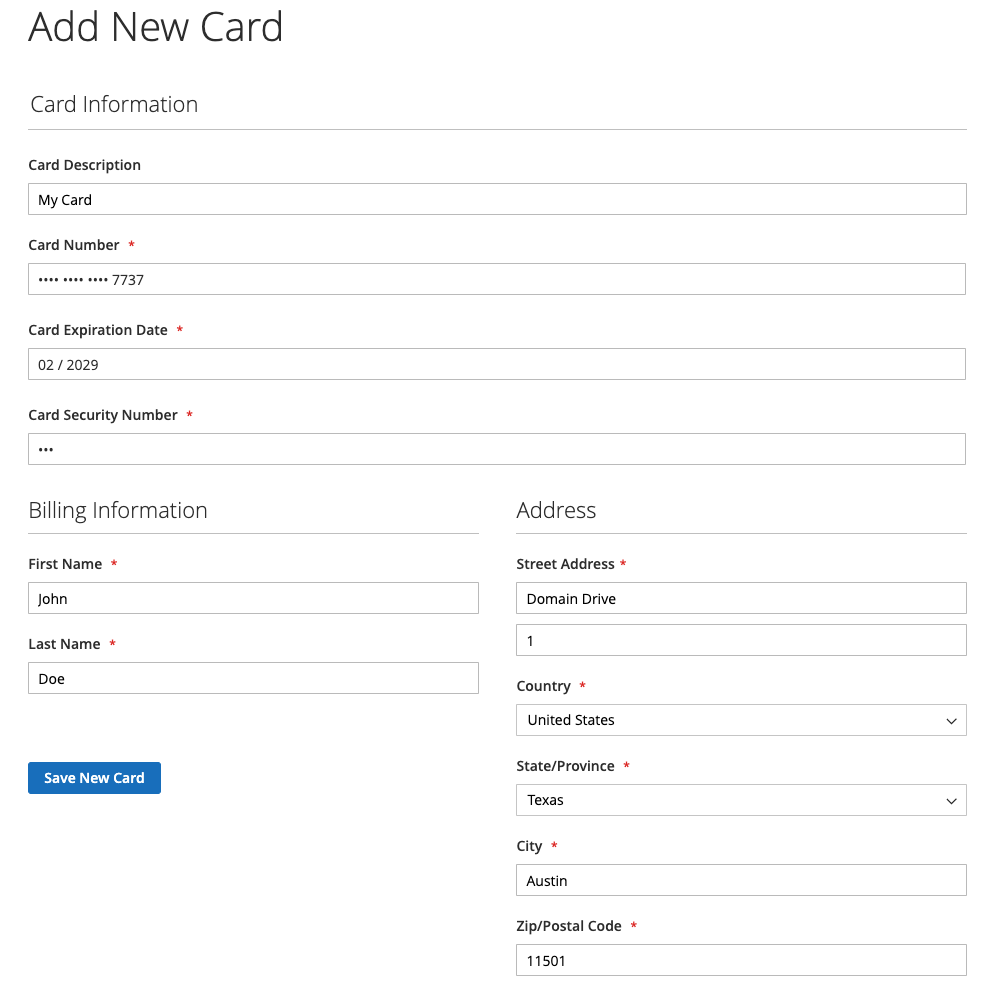

# Compartimentalização do cartão de crédito

Converta compradores únicos em clientes fiéis com cofre de cartão de crédito. Os clientes conectados podem salvar — ou &quot;salvar&quot; — suas credenciais de cartão de crédito para uso em uma compra posterior para a mesma, ou outra, loja na mesma conta de comerciante.

## Ativar compartimentação

Os comerciantes podem habilitar a cofre de cartão de crédito para suas lojas nas [!DNL Payment Services] [Configurações](configure-admin.md#card-vaulting).

1. Na barra lateral _Admin_, vá para **[!UICONTROL Sales]** > **[!UICONTROL Payment Services]**.

1. Clique em **[!UICONTROL Settings]**.

1. Alternar o seletor **[!UICONTROL Vault enabled]**. Consulte [Habilitar [!DNL Payment Services]](configure-admin.md#enable-payment-services) para obter mais informações.

## Compartimentalização sem compra

Os clientes conectados podem colocar no cofre um método de pagamento no painel **Minha Conta** ao:

1. Fazendo login em sua **Minha conta** na loja.

1. Navegando até **[!UICONTROL Stored Payment Methods]** na navegação à esquerda para ver todos os métodos de pagamento armazenados.

   Consulte [Métodos de pagamento armazenados](https://experienceleague.adobe.com/en/docs/commerce-admin/stores-sales/payments/stored-payment-methods) para obter mais informações.

1. O cliente clica em **[!UICONTROL Add New Card]** para armazenar um novo cartão.

   {width="400" zoomable="yes"}

   O cliente deve fornecer todos os detalhes necessários, como informações de cartão e faturamento, para compartimentar o método de pagamento.
Todos os métodos de pagamento com cofre usam o endereço de cobrança definido durante o cofre do cartão, que está na conta do PayPal do comprador. O cliente pode ver um endereço de faturamento diferente do exibido no Commerce.

1. Clique em **[!UICONTROL Save New Card]**

   {width="400" zoomable="yes"}

Os cartões armazenados são elegíveis para uso ao fazer um pedido:

{width="400" zoomable="yes"}

### Excluir um método de pagamento armazenado

Os clientes podem excluir facilmente os cartões de crédito com cofre dos **Métodos de Pagamento Armazenados** na **Minha Conta** clicando em **Excluir** de um cartão específico.

## Compartimentalização de um método de pagamento durante a finalização da compra

Os clientes conectados podem transferir um cartão de crédito durante a finalização da compra para usar em compras posteriores na loja atual ou em outras lojas na mesma conta de comerciante:

{width="400" zoomable="yes"}

O Commerce armazena um token que ajuda os clientes a concluírem check-outs futuros buscando as informações de cartão de crédito salvas. Copiar um cartão da conta do cliente ou durante o check-out resultará em tokens de pagamento diferentes.

>[!WARNING]
>
> Atualmente, o PayPal pode armazenar no máximo cinco cartões com cofre.

## Usar a compartimentalização no Admin

Se um cliente tiver um cartão de crédito com cofre anterior, um comerciante poderá criar uma ordem subsequente para esse cliente no Administrador usando qualquer um desses métodos de pagamento com cofre.

Você só poderá usar cartões com cofre no Administrador se o cliente tiver uma conta existente e um token válido armazenado no sistema a partir de um pagamento concluído anteriormente.

Para criar um pedido no Administrador para um cliente usando seu cartão de crédito com cofre:

1. [Criar um pedido e adicionar produtos](https://experienceleague.adobe.com/docs/commerce-admin/stores-sales/point-of-purchase/assist/customer-account-create-order.html).
1. Em _[!UICONTROL Payment & Shipping Information]_, selecione **[!UICONTROL Stored Cards]**&#x200B;como método de pagamento.
1. Selecione o método de pagamento com cartão de crédito com cofre desejado.
1. Após concluir quaisquer outras etapas necessárias para o pedido, [envie-o](https://experienceleague.adobe.com/docs/commerce-admin/stores-sales/point-of-purchase/assist/customer-account-create-order.html?lang=en#step-3%3A-submit-the-order).

   {width="600" zoomable="yes"}

## Segurança

As informações mínimas do cartão de crédito são compartilhadas com o comprador; eles veem apenas os últimos quatro dígitos, a data de expiração e a marca do cartão de crédito com cofre. As informações de cartão de crédito são armazenadas com o provedor de pagamento para atender aos padrões de conformidade [PCI](security.md#PCI-compliance).
