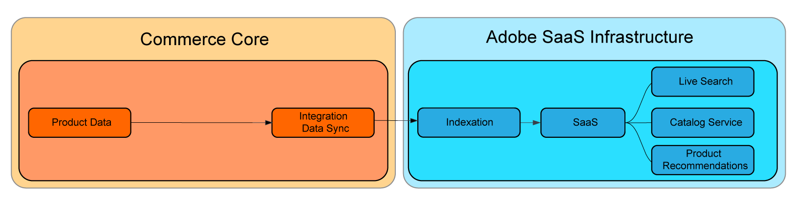

# Indexação de preços SaaS

A indexação de preços SaaS otimiza o desempenho do site, transferindo tarefas que consomem muitos recursos, como indexação e cálculo de preços, do aplicativo Commerce para a infraestrutura em nuvem da Adobe. Essa abordagem permite que os comerciantes dimensionem rapidamente os recursos para acelerar os tempos de indexação de preços e fornecer atualizações de preços à loja e aos serviços conectados da Commerce com mais rapidez.

O diagrama a seguir mostra o fluxo de dados de indexação para serviços SaaS quando a Commerce está usando o processo [indexação de preço](https://experienceleague.adobe.com/en/docs/commerce-operations/configuration-guide/cli/manage-indexers) incluído no aplicativo do Commerce:


Com a indexação de preço SaaS ativada, o fluxo de dados é alterado. A indexação de preços é executada usando a [exportação de dados SaaS do Commerce](../data-export/data-synchronization.md).



Todos os comerciantes podem se beneficiar do uso da indexação de preços SaaS, mas os comerciantes que têm projetos com as seguintes características podem obter os maiores ganhos:

* **Alterações constantes de preço**-Comerciantes que exigem alterações repetidas em seus preços para atender a metas estratégicas, como promoções frequentes, descontos sazonais ou markdowns de estoque.
* **Vários sites e/ou grupos de clientes**-Comerciantes com catálogos de produtos compartilhados em vários sites (domínios/marcas) e/ou grupos de clientes.
* **Muitos preços únicos em sites ou grupos de clientes**-Comerciantes com catálogos de produtos compartilhados extensos que contêm preços únicos em sites ou grupos de clientes. Os exemplos incluem comerciantes B2B que têm preços pré-negociados ou marcas com estratégias de preços diferentes.

## Usar indexação de preços SaaS

A indexação de preços do SaaS é ativada automaticamente ao instalar os Serviços da Adobe Commerce. Ele oferece suporte ao cálculo de preço para todos os tipos de produto Adobe Commerce incorporados.

### Requisitos

* Adobe Commerce 2.4.4+

### Pré-requisitos

* Um dos seguintes serviços da Commerce deve ser instalado com a versão mais recente da extensão do Commerce:

   * [Serviço de catálogo](../catalog-service/overview.md)
   * [Live Search](../live-search/overview.md)
   * [Recomendações de produto](../product-recommendations/guide-overview.md)


>[!NOTE]
>
>Se necessário, o indexador de preço padrão no aplicativo do Commerce pode ser desabilitado usando o [Adaptador de Catálogo](catalog-adapter.md).

## Sincronizar preços com a indexação de preços SaaS

Depois de ativar a indexação de preços SaaS para o Adobe Commerce, atualize os preços na Loja e nos Serviços da Commerce sincronizando os novos feeds:

```bash
bin/magento saas:resync --feed=scopesCustomerGroup
bin/magento saas:resync --feed=scopesWebsite
bin/magento saas:resync --feed=prices
```

### Preços para tipos de produtos personalizados

Os cálculos de preço são compatíveis com tipos de produtos personalizados, como preço base, preço especial, preço de grupo, preço de regra de catálogo e assim por diante.

Se você tiver um tipo de produto personalizado que usa uma fórmula específica para calcular o preço final, será possível estender o comportamento do feed de preço do produto.

1. Crie um plug-in na classe `Magento\ProductPriceDataExporter\Model\Provider\ProductPrice`.

   ```xml
   <config xmlns:xsi="http://www.w3.org/2001/XMLSchema-instance"
           xsi:noNamespaceSchemaLocation="urn:magento:framework:ObjectManager/etc/config.xsd">
       <type name="Magento\ProductPriceDataExporter\Model\Provider\ProductPrice">
           <plugin name="custom_type_price_feed" type="YourModule\CustomProductType\Plugin\UpdatePriceFromFeed" />
       </type>
   </config>
   ```

1. Crie um método com a fórmula personalizada:

   ```php
   class UpdatePriceFromFeed
   {
       /**
       * @param ProductPrice $subject
       * @param array $result
       * @param array $values
       *
       * @return array
       */
       public function afterGet(ProductPrice $subject, array $result, array $values) : array
       {
           // Override the output $result with your data for the corresponding products (see original method for details) 
           return $result;
       }
   }
   ```

