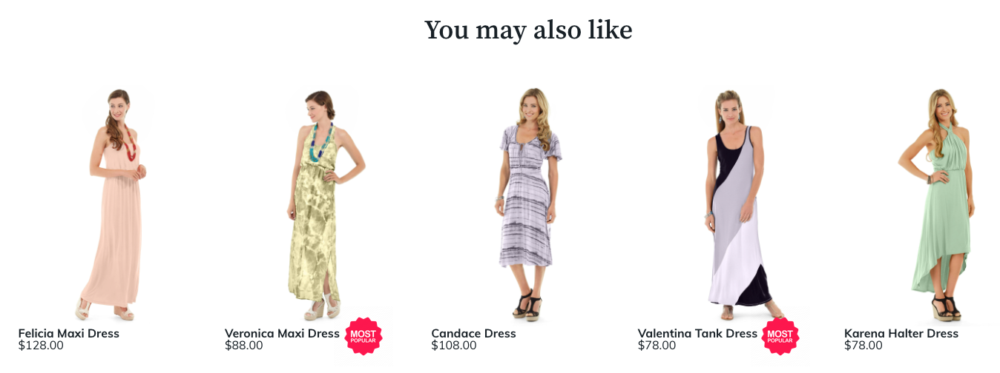

# Personalizar

Ao instalar o módulo Product Recommendations, o Adobe Commerce cria o diretório `ProductRecommendationsLayout`. Esse diretório contém arquivos de modelo que podem ser personalizados para alterar a forma como as recomendações são exibidas na loja. Especificamente, você pode modificar ou substituir o seguinte modelo:

`<your theme>/Magento_ProductRecommendationsLayout/web/template/recommendations.html`

Para obter mais informações sobre a modificação de arquivos de modelo, consulte [Personalização de modelo](https://developer.adobe.com/commerce/frontend-core/guide/templates/walkthrough/) no Guia do Desenvolvedor de Front-end.

Se você modificar o arquivo `recommendations.html`, deverá preservar as seguintes marcas no arquivo para garantir que o Adobe Commerce possa coletar métricas de recomendação da sua loja:

| Tag | Uso |
|---|---|
| `<div data-bind="attr : {'data-unit-id' : unitId }"...</div>` | Coleta eventos de exibição. |
| `<a data-bind="attr : {'data-sku' : sku, 'data-unit-id'}"...</a>` | Coleta eventos de clique. <br/>**Observação:** se você adicionar marcas de âncora, será necessário incluir esses atributos. |

Além do arquivo `recommendations.html`, o diretório `ProductRecommendationsLayout` contém os seguintes subdiretórios:

| Diretório | Finalidade |
|---|---|
| `layout` | Contém `*.xml` arquivos para cada tipo de página |
| `templates` | Contém arquivos que chamam os scripts de busca e renderização |
| `web/js` | Contém os arquivos JavaScript que buscam e renderizam recomendações para sua loja |
| `web/template` | Contém o modelo para o módulo `magento/product-recommendations` |

## Posicionamento da unidade de recomendação

Ao [criar](create.md) uma recomendação, especifique o [local](placement.md) onde ele aparece na página. Uma unidade de recomendação pode ser colocada na parte superior ou inferior do container de conteúdo principal. No entanto, é possível personalizar essa disposição. Se você criar um tipo de conteúdo de recomendação do Page Builder, use as ferramentas do Page Builder para posicionar a unidade de recomendação na página. Para todos os outros tipos de página, edite os arquivos `*.xml` gerados quando a recomendação é criada.

1. Alterar para o diretório `layout`:

   ```bash
   cd `<your theme>/Magento_ProductRecommendationsLayout/layout`
   ```

   A tabela a seguir lista os arquivos XML presentes nesse diretório:

   | Nome do arquivo | Página |
   |---|---|
   | `catalog_category_view.xml` | Categoria |
   | `catalog_product_view.xml` | Detalhes do produto |
   | `checkout_cart_index.xml` | Carrinho |
   | `checkout_onepage_success.xml` | Check-out |
   | `cms_index_index.xml` | Início |

   >[!NOTE]
   >
   >Os nomes de arquivos no diretório `layout` podem ser diferentes se o armazenamento usar extensões de terceiros.

1. Modifique o arquivo `catalog_product_view.xml` para que a unidade de recomendação apareça após a imagem do produto na página de detalhes do produto. Antes de personalizar esse arquivo XML, examine-o e entenda as seções que você precisará modificar:

   ```xml
   <?xml version="1.0"?>
   <page xmlns:xsi="http://www.w3.org/2001/XMLSchema-instance" xsi:noNamespaceSchemaLocation="urn:magento:framework:View/Layout/etc/page_configuration.xsd">
       <referenceBlock name="page.wrapper">
           <block class="Magento\Framework\View\Element\Template" before="-" name="product_recommendations_fetcher" template="Magento_ProductRecommendationsStorefront::fetcher.phtml" />
       </referenceBlock>
       <body>
           <referenceBlock name="main.content">
               <block class="Magento\ProductRecommendationsStorefront\Block\Renderer" after="-" name="product_recommendations_product_below_content" template="Magento_ProductRecommendationsStorefront::renderer.phtml">
                   <arguments>
                       <argument name="pagePlacement" xsi:type="string">below-main-content</argument>
                   </arguments>
               </block>
           </referenceBlock>
       </body>
   </page>
   ```

   No trecho acima, o bloco de referência `main.content` indica que a unidade de recomendação será colocada em algum lugar relativo a esse elemento. Seu elemento `block` contém o atributo `after="-"`, que especifica que a unidade de recomendação será exibida na página após o bloco de conteúdo principal.

1. Vamos modificar esse arquivo especificando um bloco de conteúdo diferente.

   Alterar o bloco de referência `name` de `main.content` para `product.info.media`.

   ```xml
   <?xml version="1.0"?>
   <page xmlns:xsi="http://www.w3.org/2001/XMLSchema-instance" xsi:noNamespaceSchemaLocation="urn:magento:framework:View/Layout/etc/page_configuration.xsd">
       <referenceBlock name="page.wrapper">
           <block class="Magento\Framework\View\Element\Template" before="-" name="product_recommendations_fetcher" template="Magento_ProductRecommendationsStorefront::fetcher.phtml" />
       </referenceBlock>
       <body>
           <referenceBlock name="product.info.media">
               <block class="Magento\ProductRecommendationsStorefront\Block\Renderer" after="-" name="product_recommendations_product_below_content" template="Magento_ProductRecommendationsStorefront::renderer.phtml">
                   <arguments>
                       <argument name="pagePlacement" xsi:type="string">below-main-content</argument>
                   </arguments>
               </block>
           </referenceBlock>
       </body>
   </page>
   ```

   Essa alteração faz com que sua unidade de recomendação apareça depois da imagem do produto na página Detalhes do produto. Se desejar que a unidade de recomendação apareça antes de `product.info.media`, altere o atributo `after="-"` para `before="-"`. O argumento `pagePlacement` é um argumento interno que não deve ser modificado.

Consulte [visão geral do layout](https://developer.adobe.com/commerce/frontend-core/guide/layouts/) para obter mais informações sobre os tipos de blocos na página.

## Atributos de produto personalizados

Os desenvolvedores geralmente precisam acessar valores de atributos de produto personalizados em unidades de recomendações em vitrines para que possam adicionar tratamentos visuais aos produtos com base nesses atributos.

Por exemplo, se sua loja vende alguns produtos orgânicos, você pode ter um atributo personalizado nesses produtos designando-os como `Organic = Yes`. Talvez seja necessário acessar esse valor de atributo na loja para que você possa dar a esses produtos um tratamento visual especial quando eles aparecerem no Recommendations. Da mesma forma, o acesso a esses valores de atributos de produto personalizados permite marcar os produtos ou direcionar a lógica personalizada na camada de apresentação do site.



Para garantir que um atributo de produto personalizado esteja disponível ao renderizar a unidade de recomendação na página, defina a propriedade `Used in Product Listing` como `Yes` na página [Atributos de Produto](https://experienceleague.adobe.com/docs/commerce-admin/catalog/product-attributes/create/attribute-product-create.html) no Administrador.

Quando essa propriedade é definida, a carga JSON inclui um objeto `attributes` que contém uma matriz de códigos e valores de atributo. É possível aplicar o estilo personalizado da loja com base nesses valores de atributo, como adicionar tratamentos visuais especiais ou selos, conforme mencionado anteriormente.

>[!NOTE]
>
>As alterações no atributo do produto podem levar até uma hora para serem exibidas na carga JSON.
