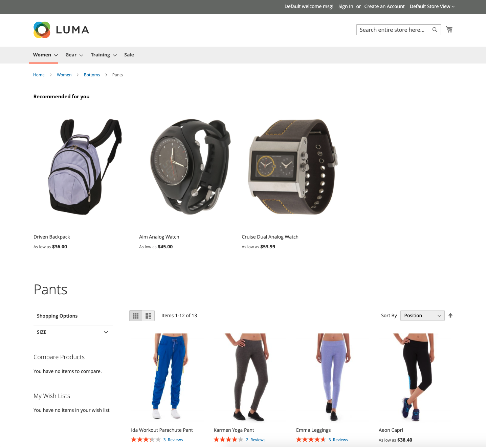

# Posicionamento e rótulos

Com tantos tipos de recomendações para escolher, qual você deve usar em cada página? Se não tiver certeza de onde começar, tente o seguinte:

| Página | Tipo de recomendação |
|---|---|
| Home page | `Recommended for you` |
| Página do produto | `Viewed this, viewed that` |
| Carrinho | `Bought this, bought that` |

Você pode acompanhar as [métricas](workspace.md) e ajustar, se necessário. Lembre-se de que a experimentação é a chave.

Algumas páginas de vitrine restringem o local em que você pode colocar as recomendações. Você pode colocar as recomendações em um dos seguintes locais de página. Consulte a tabela abaixo para obter mais informações.

- Na parte superior do conteúdo principal - As recomendações são exibidas acima da área de conteúdo principal, logo abaixo da barra de navegação superior.
- Na parte inferior do conteúdo principal (padrão) - As recomendações são exibidas abaixo da área de conteúdo principal e antes de qualquer outro bloco de conteúdo na página, como _Produtos relacionados_.

_Recomendação na parte superior da home page_

## Rótulos de recomendação

O rótulo atribuído a uma recomendação na loja afeta como os compradores interpretam sua relevância para eles. Os rótulos a seguir são usados com frequência para cada tipo de recomendação.

_Recomendação na parte superior dos resultados da pesquisa_

| Tipo de recomendação | Rótulos recomendados |
|---|---|
| Mais visualizados  Mais adicionados ao carrinho Mais comprados Conversão (exibir para carrinho) Conversão (exibir para compra) |  Itens mais populares Tendências Populares no momento Recentemente populares Itens populares inspirados por este item (PDP) Mais vendidos Talvez você esteja interessado em |
| Recomendado para você | Apenas para você Recomendado para você Inspirado pelas suas tendências de compras |
| Visualizou Isso, Visualizou Aquilo | Os clientes que visualizaram este item também visualizaram Os clientes também visualizaram itens relacionados |
| Visualizou Isto, Comprou Aquilo | Clientes que visualizaram este item acabaram comprando Clientes comprados O que outros compram depois de visualizar este item? |
| Comprei isto, comprei aquilo | Obtenha tudo o que precisa Não se esqueça disso Comprados com frequência |
| Mais artigos como este | Mais itens como este Semelhantes a este |
| Genérico | Você também pode gostar de Compradores também curtiram Opções semelhantes Itens relacionados |
| Tendências | Tendências Tendências atuais Tendências recentes Itens importantes Produtos relacionados às tendências (PDP) |
| Visualizado recentemente | Visualizado recentemente Dê outra olhada |

## Recomendações compatíveis por página

A tabela a seguir lista as páginas de vitrine onde você pode colocar recomendações e os tipos de recomendação permitidos em cada página.

| Página | Recomendações de posicionamento | Tipos |
|---|---|---|
| Home page | Na parte superior do conteúdo principal Na parte inferior do conteúdo principal (padrão) | Mais visualizados Mais comprados Mais adicionados ao carrinho Recomendado para você Tendências |
| Categoria | Na parte superior do conteúdo principal Na parte inferior do conteúdo principal (padrão) | Mais visualizados Mais comprados Mais adicionados ao carrinho Recomendado para você Tendências |
| Detalhes do produto | Na parte inferior do conteúdo principal (padrão) | Mais visualizados Mais comprados Mais adicionados ao carrinho Visualizaram isto, visualizaram aquilo Visualizaram isto, compraram aquilo Compraram isto, compraram aquilo Mais parecidos com isto Tendências Similaridade visual |
| Carrinho | Na parte inferior do conteúdo principal (padrão) | Mais visualizados Mais comprados Mais adicionados ao carrinho Visualizaram isto, visualizaram aquilo Visualizaram isto, compraram aquilo Compraram isto, compraram aquilo Mais como isto Tendências |
| Confirmação | Na parte inferior do conteúdo principal (padrão) | Mais visualizados Mais comprados Mais adicionados ao carrinho Visualizaram isto, visualizaram aquilo Visualizaram isto, compraram aquilo Compraram isto, compraram aquilo Mais como isto Tendências |
| Page Builder | [Arrastar e soltar](https://experienceleague.adobe.com/docs/commerce-admin/page-builder/add-content/recommendations.html) para posicionar o tipo de conteúdo | Mais visualizados Mais comprados Mais adicionados ao carrinho Recomendado para você Tendências |
