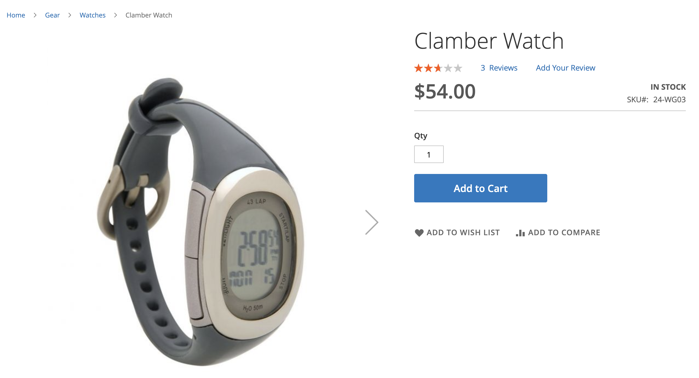
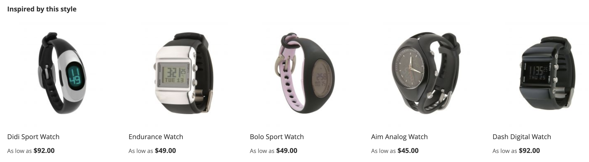

# Tipos de Recomendação

O Adobe Commerce fornece um grande conjunto de recomendações que você pode implantar em várias páginas do site. Todos os tipos de recomendações são orientados por dados. Eles são alimentados por dados comportamentais, dados de atributos de produto e métricas. Para facilitar a referência, os tipos de recomendação são agrupados da seguinte maneira:

- [Personalizado](#personalized)
- [Vendas cruzadas e vendas adicionais](#crossup)
- [População](#popularity)
- [Alto desempenho](#highperf)

Como prática recomendada, a Adobe recomenda as seguintes diretrizes ao usar o recommendations:

- Diversifique seus tipos de recomendação. Os clientes começam a ignorar as recomendações se sugerirem os mesmos produtos repetidamente.

- Não implante as mesmas recomendações na página do carrinho e na página de confirmação de pedido. Considere usar `Most Added to Cart` para a página do carrinho e `Bought This, Bought That` para a página de confirmação de pedido.

- Mantenha seu site organizado. Não implante mais de três unidades de recomendação na mesma página.

- Se sua loja vende roupas, a recomendação `More like this` pode sugerir produtos específicos de gênero que não correspondem ao gênero do produto que está sendo visualizado. Considere usar esse tipo de recomendação somente para categorias que não sejam de roupas.

>[!NOTE]
>
>Para obter mais informações sobre os eventos descritos neste artigo, consulte [eventos da loja](https://developer.adobe.com/commerce/services/shared-services/storefront-events/#product-recommendations) na documentação do desenvolvedor.

## Personalizado {#personalized}

Esses tipos de recomendações recomendam produtos com base no histórico comportamental específico do comprador em seu site. Por exemplo, se um comprador já buscou uma jaqueta ou comprou uma jaqueta no seu site, essas recomendações basicamente escolhem onde pararam e recomendam outras jaquetas ou produtos semelhantes.

| Tipo | Descrição |
|---|---|
| Recomendado para você | Recomenda produtos com base no comportamento atual e anterior de cada comprador no local. Exibe recomendações altamente relevantes com base no histórico de navegação e compra do comprador. Esse tipo de recomendação é eficaz na página inicial, onde a maioria dos compradores começa sua jornada em um site. Para compradores pela primeira vez em seu site que não geraram nenhum sinal para personalizar sua experiência, o Adobe Commerce mostra produtos com base no tipo de recomendação Mais visualizados. Quando o comprador começa a interagir com os produtos no site, no entanto, os produtos recomendados se ajustam em tempo real ao seu comportamento.  **Onde usado:** - Página inicial - Categoria   **Rótulos sugeridos:**  - Apenas para você - Recomendado para você - Inspirado pelas suas tendências de compras |
| Visualizado recentemente | Exibe os produtos visualizados mais recentemente pelo comprador, com base no histórico do navegador. Todos os produtos excluídos são removidos pela unidade de recomendação. A unidade de recomendação não será exibida se não houver histórico do navegador ou se não houver histórico suficiente quando as regras de filtro forem aplicadas. Se os resultados contiverem menos produtos do que o configurado, a unidade de recomendação exibirá somente os produtos retornados.  **Onde usado:** - Página inicial - Categoria - Detalhes do produto - Carrinho - Confirmação   **Rótulos sugeridos:** - Visualizados recentemente - Dê outra olhada |

## Vendas cruzadas e vendas adicionais {#crossup}

Esses tipos de recomendações são orientados à prova social para ajudar os compradores a encontrar o que outros gostaram ou orientados por produtos para ajudá-los a encontrar outros produtos semelhantes. Os produtos recomendados geralmente complementam o produto selecionado.

>[!NOTE]
>
>Os tipos de recomendação &quot;visualizou isto, visualizou aquilo&quot;, &quot;visualizou isto, comprou aquilo&quot; e &quot;comprou isto, comprou aquilo&quot; não usam uma métrica de ocorrência simples, mas sim um algoritmo mais sofisticado de filtragem colaborativa que busca *semelhanças interessantes* que não se voltam para produtos populares. Os dados usados para informar esses tipos de recomendações são baseados no comportamento agregado do comprador derivado de várias sessões do site. Os dados não se baseiam no comportamento do comprador derivado de uma única ocorrência na sessão do site. Esses tipos de recomendações ajudam os compradores a encontrar os produtos adjacentes que podem não ser óbvios para emparelhar com o produto visualizado atualmente.

| Tipo | Descrição |
|---|---|
| Visualizou isto, visualizou aquilo | Recomenda produtos que os compradores visualizam com mais frequência do que os produtos visualizados no momento.  **Onde usado:** - Detalhes do produto - Carrinho - Confirmação   **Rótulos sugeridos:** - Clientes que visualizaram este produto também visualizaram (PDP) |
| Visualizou isto, comprou aquilo | Recomenda produtos que os compradores tendem a comprar de forma desproporcional mais frequente depois de visualizar o produto atual. Esse tipo ajuda a orientar os compradores a descobrir produtos que eles podem não ter notado de outra forma.  **Onde usado:** - Detalhes do produto - Carrinho - Confirmação   **Rótulos sugeridos:** - Clientes que viram esta última compra - Clientes comprados por fim - O que outros compram depois de visualizar este produto? |
| Comprei isto, comprei aquilo | Recomenda produtos que os compradores compram com mais frequência do que o produto visualizado atualmente. Esse tipo exibe produtos altamente relevantes que os compradores podem adicionar ao carrinho agregando o que outros compradores compraram com o produto atual.  **Onde usado:** - Detalhes do produto - Carrinho - Confirmação   **Rótulos sugeridos:** - Obtenha tudo o que precisa - Não se esqueça destes - Comprados com frequência |
| Veja mais aqui | Recomenda produtos com base em metadados semelhantes, como nome, descrição, atribuição de categoria e atributos. Ao avaliar os atributos dos produtos que estão sendo visualizados, esse tipo recomenda produtos semelhantes na mesma categoria. Por exemplo, se um comprador estiver navegando em tapetes de ioga, outros produtos na categoria de equipamentos são recomendados. Como esse tipo de recomendação não distingue sexos, não é recomendado para roupas, moda ou outros setores verticais específicos de gênero.  **Onde usado:** - Detalhes do produto - Carrinho - Confirmação   **Rótulos sugeridos:**  - Mais produtos como este - Semelhante a este |
| [Semelhança visual](#visualsim) | Recomenda produtos com aparência semelhante ao produto que está sendo visualizado. Esse tipo de recomendação é mais útil se as imagens e os aspectos visuais dos produtos forem importantes para a experiência de compra. |

## População {#popularity}

Esses tipos de recomendações recomendam produtos que são os mais populares ou em tendência nos últimos sete dias.

| Tipo | Descrição |
|---|---|
| Mais visualizados | Recomenda produtos que foram mais visualizados ao contar o número de sessões em que uma ação de visualização ocorreu nos últimos sete dias.  **Onde usado:** - Página inicial - Categoria - Detalhes do produto - Carrinho - Confirmação   **Rótulos sugeridos:** - Mais popular - Tendências - Popular no momento - Popular no momento - Produtos populares inspirados neste produto (PDP) - Mais vendidos |
| Mais comprados | Recomenda os produtos comprados com mais frequência pelos compradores nos últimos sete dias.  **Onde usado:** - Página inicial - Categoria - Detalhes do produto - Carrinho - Confirmação   **Rótulos sugeridos:**  - Mais popular - Tendências - Popular no momento - Popular no momento - Produtos populares inspirados neste produto (PDP) - Mais vendidos |
| Mais adicionados ao carrinho | Recomenda os produtos adicionados com mais frequência aos carrinhos pelos compradores nos últimos sete dias. Esse tipo de recomendação pode ser usado em todas as páginas.  **Onde usado:** - Página inicial - Categoria - Detalhes do produto - Carrinho - Confirmação   **Rótulos sugeridos:**  - Mais popular - Tendências - Popular no momento - Popular no momento - Produtos populares inspirados neste produto (PDP) - Mais vendidos |
| Tendências | Recomenda produtos com base na popularidade recente de um produto em seu site.  A Adobe Sensei agrega dados de navegação e compra em todo o site para determinar e classificar quais produtos são os mais populares entre seus compradores. Como a análise de tendências analisa o impulso recente do produto, ela é um tipo de recomendação eficiente para catálogos que têm um alto faturamento. Se o catálogo for mais estático, talvez não seja tão útil, a menos que os padrões de compra do público-alvo sejam altamente variáveis.  Quando usado na home page, a seção Tendências recomenda produtos que são populares recentemente em todo o site. As tendências não exibem produtos que são consistentemente populares, mas sim aqueles que se tornaram populares recentemente. Por exemplo, se você tiver uma campanha de marketing por email promovendo determinados produtos, o aumento de popularidade gerado pelo email aumenta a probabilidade de os produtos promovidos serem classificados como de tendência.  **Onde usado:** - Página inicial - Categoria - Detalhes do produto - Carrinho - Confirmação   **Rótulos sugeridos:** - Tendências - Tendências agora - Tendências recentes - Produtos importantes - Tendências relacionadas aos produtos (PDP) |

## Alto desempenho {#highperf}

Esses tipos de recomendações recomendam produtos de melhor desempenho com base em critérios de sucesso, como adicionar ao carrinho ou taxas de conversão.

| Tipo | Descrição |
|---|---|
| Exibir para conversão de compra | Recomenda produtos com a mais alta taxa de conversão de visualização para compra. De todas as sessões do comprador que registraram uma visualização de produto, qual é a proporção de que eventualmente registrou uma compra pelo comprador.  **Onde usado:** - Página inicial - Categoria - Detalhes do produto - Carrinho - Confirmação   **Rótulos sugeridos:**  -Mais vendidos - Produtos populares - Talvez você esteja interessado |
| Exibição para conversão de carrinho | Recomenda produtos com a mais alta taxa de conversão de visualização ao carrinho. De todas as sessões de compradores que registraram uma visualização de produto, qual é a proporção que eventualmente registrou e adicionou ao carrinho pelo comprador.  **Onde usado:** - Página inicial - Categoria - Detalhes do produto - Carrinho - Confirmação   **Rótulos sugeridos:**  - Principais vendedores - Produtos populares - Talvez você esteja interessado |
| Mais comprados | Geralmente chamado de &quot;Mais vendidos&quot;, esse tipo de recomendação conta o número de sessões em que uma ação de solicitação de local ocorreu nos últimos sete dias. Esse tipo de recomendação pode ser usado em todas as páginas.  **Onde usado:** - Página inicial - Categoria - Detalhes do produto - Carrinho - Confirmação   **Rótulos sugeridos:**  - Mais popular - Tendências - Popular no momento - Popular no momento - Produtos populares inspirados neste produto (PDP) - Mais vendidos |
| Mais adicionados ao carrinho | Recomenda os produtos adicionados com mais frequência aos carrinhos pelos compradores nos últimos sete dias. Esse tipo de recomendação pode ser usado em todas as páginas.  **Onde usado:** - Página inicial - Categoria - Detalhes do produto - Carrinho - Confirmação   **Rótulos sugeridos:**  - Mais popular - Tendências - Popular no momento - Popular no momento - Produtos populares inspirados neste produto (PDP) - Mais vendidos |

## Semelhança visual {#visualsim}

O tipo de recomendação _Semelhança visual_ recomenda produtos de aparência semelhante ao produto que está sendo visualizado. Esse tipo de recomendação é mais útil quando imagens e aspectos visuais dos produtos são partes importantes da experiência de compra.

### Como funciona

O tipo de recomendação _Similaridade visual_ oferece recomendações para outros produtos em seu catálogo que têm uma similaridade visual com as imagens sendo visualizadas no momento. A semelhança visual inclui aspectos como:

- Cor
- Forma
- Tamanho
- Textura
- Material
- Estilo

O Adobe Sensei usa IA para processar e analisar as imagens no catálogo e criar atributos usados para determinar semelhanças visuais.

>[!NOTE]
>
> Se você estiver testando esse tipo de recomendação em um ambiente de não produção, verifique se os URLs de imagem estão acessíveis publicamente.

>[!NOTE]
>
> Atualmente, as imagens do produto devem ter 10 MB ou menos.

Como esse tipo de recomendação não se aplica à maioria dos catálogos, ele não é ativado por padrão. Você deve ativar explicitamente esse tipo de recomendação.

### Habilitar tipo de recomendação de similaridade visual

>[!NOTE]
>
> O tipo de recomendação _Semelhança visual_ está disponível quando você o [instala](install-configure.md) como um módulo opcional.

1. Na barra lateral _Admin_, vá para **Marketing** > _Promoções_ > **Recomendações de Produtos** para exibir o painel _Recomendações de Produtos_.

1. Clique em **Configurações** (ícone de engrenagem) para exibir a página _Configurações_.

1. Na seção _Recomendações Visuais_, selecione **Habilitar Recomendações Visuais**.

1. Clique em **Salvar alterações** quando terminar.

   A página [Criar nova recomendação](create.md) agora exibe **Semelhança visual** como um tipo de recomendação selecionável quando o tipo de página é **Detalhes do produto**.

Após ativar as recomendações visuais, o Adobe Sensei inicia o processamento da imagem. O tempo de duração depende do tamanho do catálogo.

### Onde usado

- Detalhes do produto

### Rótulos de vitrine sugeridos

- Você também pode gostar de
- Encontramos outros produtos que talvez você goste
- Inspirado nesse estilo

### Exemplo

A imagem a seguir mostra a página de detalhes do produto da _Observação da Sala de Aula_:

O item a seguir mostra a unidade de recomendação _Semelhança visual_ para _Observação de Clâmbar_:

