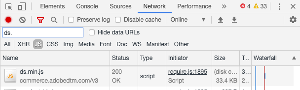

# Verificar coleção de eventos

Depois de [instalar e configurar](install-configure.md) o módulo `magento/product-recommendations`, você pode verificar se os dados comportamentais estão sendo enviados para a Adobe Commerce. Você pode usar as ferramentas de desenvolvedor disponíveis no Chrome ou instalar a extensão Snowplow Chrome. Se precisar de ajuda adicional, consulte [Solução de problemas [!DNL Product Recommendations] módulo](https://experienceleague.adobe.com/docs/commerce-knowledge-base/kb/troubleshooting/miscellaneous/troubleshoot-product-recommendations-module-in-magento-commerce.html?lang=pt-BR) na Base de Dados de Conhecimento de Suporte.

## Verificar o uso de ferramentas de desenvolvedor no Chrome

Para garantir que o arquivo JS do coletor de eventos esteja carregando em todas as páginas do site:

1. No Chrome, escolha **Personalizar e controlar o Google Chrome** e selecione **Mais Ferramentas** > **Ferramentas do Desenvolvedor**.
1. Escolha a guia **Rede** e selecione o tipo **JS**.
1. Filtro para `ds.`
1. Recarregue a página.
1. Você deve ver `ds.js` ou `ds.min.js` na coluna **Nome**.

_JS do Coletor de Eventos_

Para garantir que os eventos sejam acionados em páginas em seu site (página inicial, produto, check-out e assim por diante):

1. Desative os bloqueadores de anúncios do navegador e aceite os cookies do site.
1. No Chrome, escolha **Personalizar e controlar o Google Chrome** (os três pontos verticais no canto superior direito do navegador) e selecione **Mais Ferramentas** > **Ferramentas do Desenvolvedor**.
1. Escolha a guia **Rede** e o filtro para `tp2`.
1. Recarregue a página.
1. Você deve ver chamadas em `tp2` na coluna **Name**.

_Verifique se os eventos estão sendo disparados_

## Verificar o uso da extensão Snowplow Chrome

Instale a [Extensão do depurador do Snowplow Analytics para Chrome](https://chrome.google.com/webstore/detail/snowplow-analytics-debugg/jbnlcgeengmijcghameodeaenefieedm). Essa extensão exibe os eventos que estão sendo coletados e enviados para a Adobe Commerce.

1. Desative os bloqueadores de anúncios do navegador e aceite os cookies do site.

1. No Chrome, escolha **Personalizar e controlar o Google Chrome** (os três pontos verticais no canto superior direito do navegador) e selecione **Mais Ferramentas** > **Ferramentas do Desenvolvedor**.

1. Escolha a guia **Snowplow Analytics Debugger**.

1. Na coluna **Evento**, selecione **Evento estruturado**.

1. Role para baixo até ver **Dados de contexto _n_**. Procure a instância de vitrine no **Esquema**.

1. Verifique se a [ID do Espaço de Dados SaaS](https://experienceleague.adobe.com/docs/commerce-admin/config/services/saas.html?lang=pt-BR) está definida corretamente.

_Filtro Snowplow_

>[!NOTE]
>
> Um valor de `Data validity : NOT FOUND` no depurador indica um esquema interno. O plug-in Snowflow Chrome não pode validar os eventos com um esquema interno. Isso não afeta a funcionalidade real.

## Verifique se os eventos estão sendo acionados corretamente

Para verificar se os eventos usados para métricas estão sendo acionados corretamente, procure os eventos `impression-render`, `view` e `rec-click` no Depurador do Snowplow Analytics. Consulte a [lista completa de eventos](https://experienceleague.adobe.com/docs/commerce/product-recommendations/developer/events.html?lang=pt-BR).

>[!NOTE]
>
> Se o [Modo de restrição de cookies](https://experienceleague.adobe.com/docs/commerce-admin/start/compliance/privacy/compliance-cookie-law.html?lang=pt-BR) estiver habilitado, a Adobe Commerce não coletará dados comportamentais até que o comprador dê o seu consentimento. Se o Modo de restrição de cookie estiver desativado, os dados comportamentais serão coletados por padrão.
